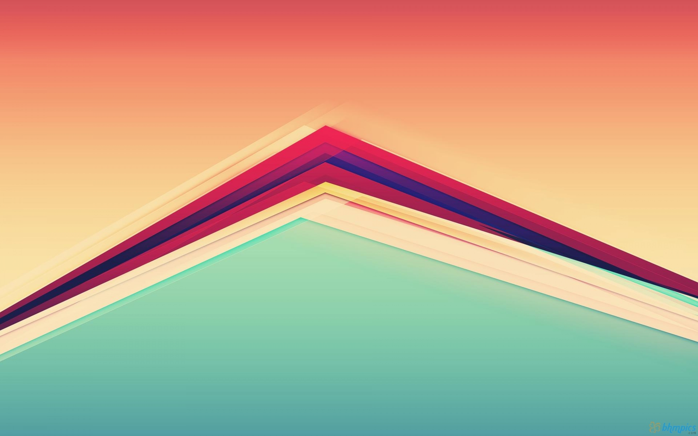
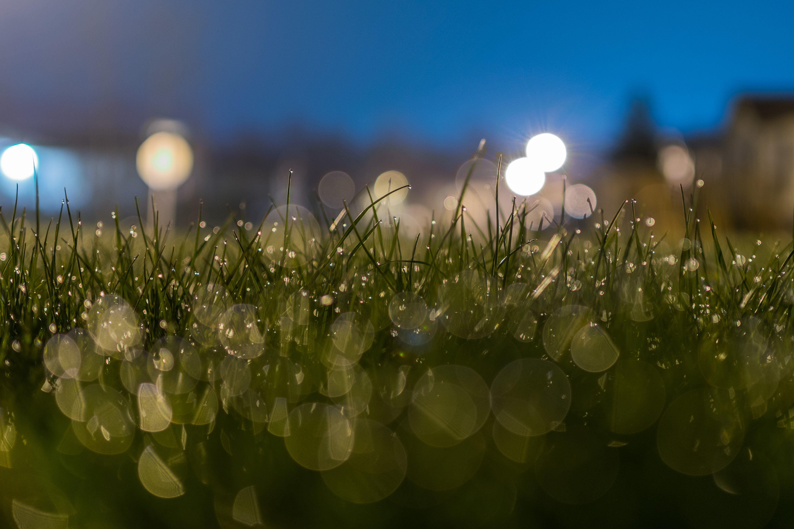
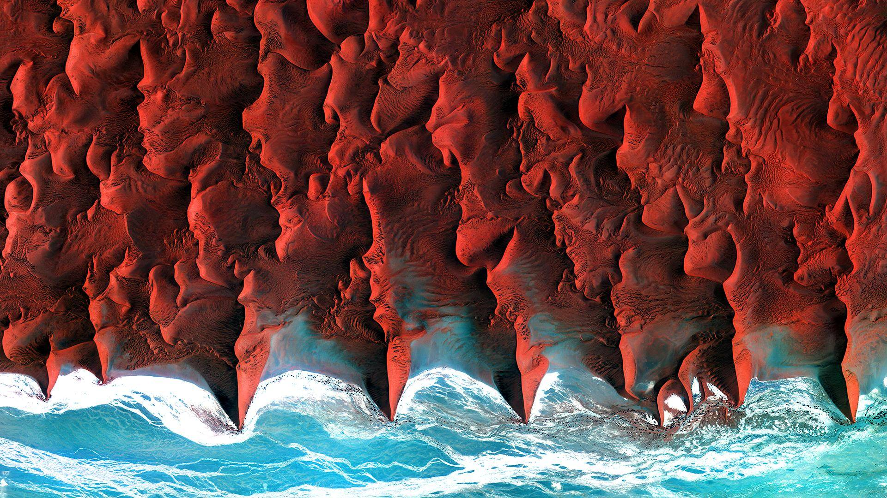
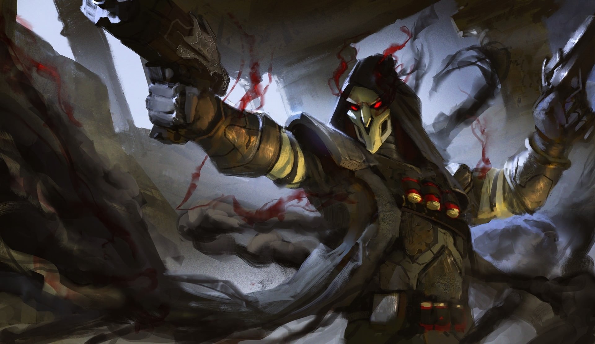
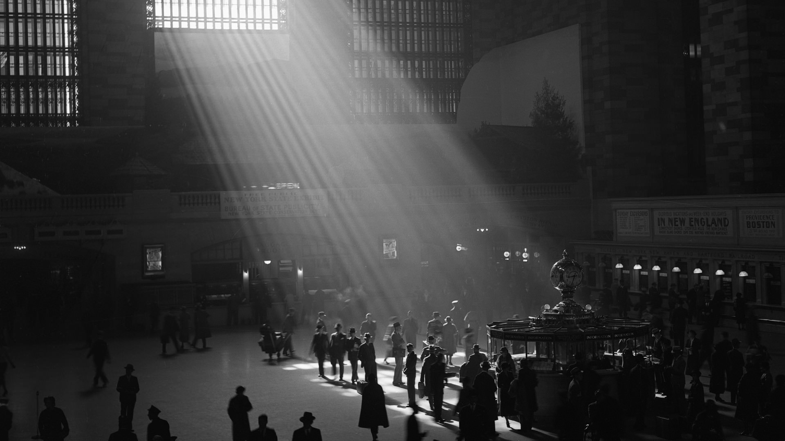
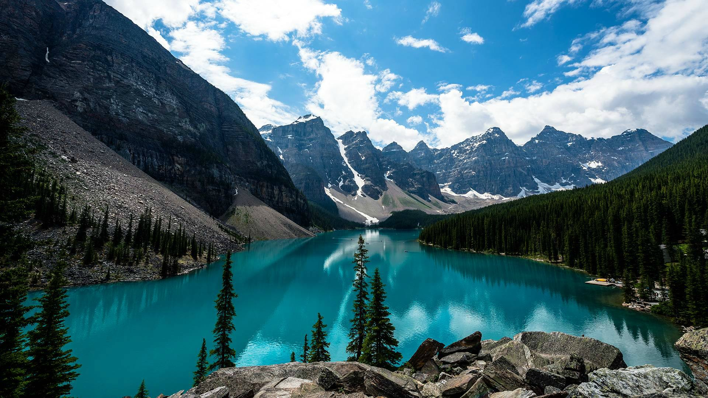
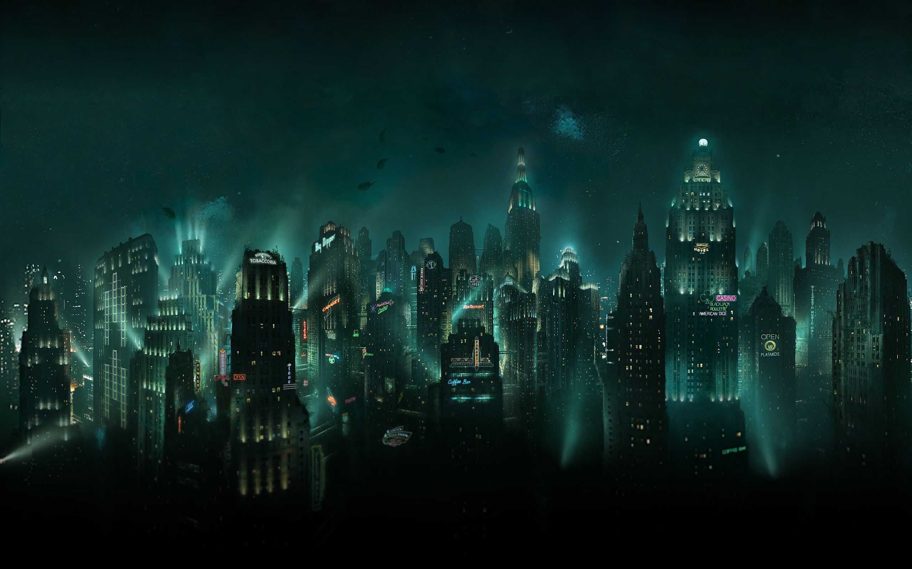
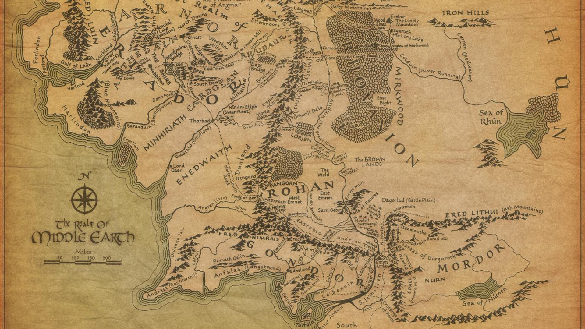
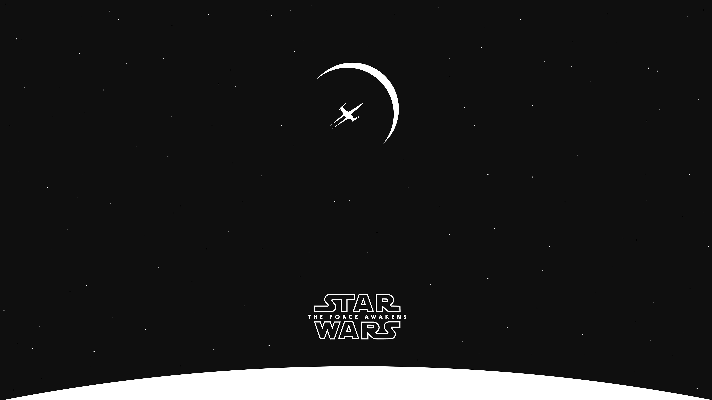
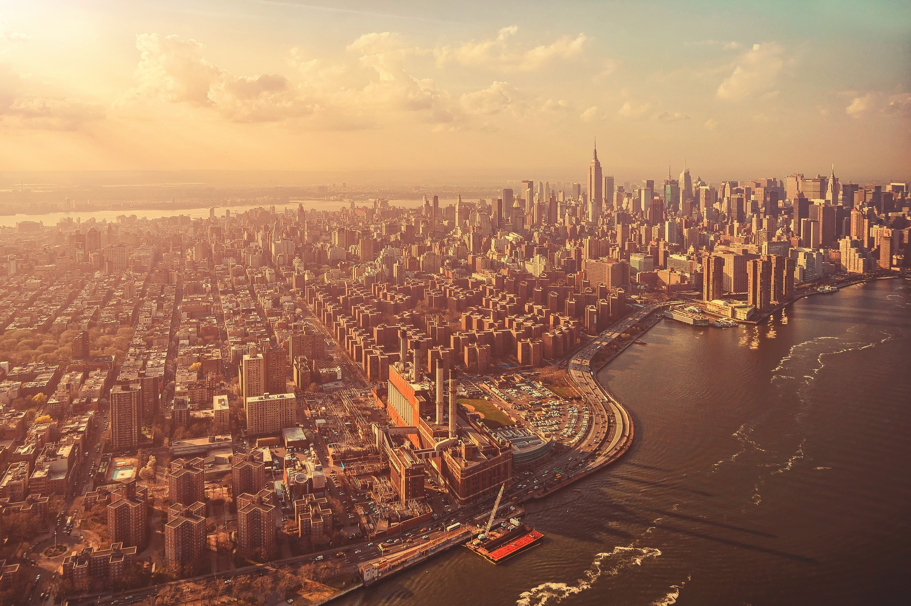

# Test Images Analysis

This document provides detailed color analysis of all test images used for validating the theme generation system. Each image is processed through the complete color extraction and theme generation pipeline.

Generated by `go run tools/analyze-images/main.go`

## abstract.jpeg

**Dimensions**: 2880 x 1800 px

### Image Colors

| Function | Value | Color |
|----------|-------|-------|
| Background | `#202020` |  |
| Foreground | `#FAE3B9` |  |
| Primary | `#F39C71` |  |
| Secondary | `#F6B982` |  |
| Accent | `#F3916E` |  |
| Most Frequent | `#F39C71` |  |

### Color Profile

| Property | Value |
|----------|-------|
| Mode | Dark |
| Color Scheme |  |
| Dominant Hue | 56.0° |
| Hue Variance | 71.4° |
| Average Luminance | 0.461 |
| Average Saturation | 0.654 |
| Grayscale? | false |
| Monochromatic? | false |

## bokeh.jpeg

**Dimensions**: 4102 x 2735 px

### Image Colors

| Function | Value | Color |
|----------|-------|-------|
| Background | `#313300` |  |
| Foreground | `#FDFDFD` |  |
| Primary | `#006BAD` |  |
| Secondary | `#006DB0` |  |
| Accent | `#0069A9` |  |
| Most Frequent | `#006BAD` |  |

### Color Profile

| Property | Value |
|----------|-------|
| Mode | Dark |
| Color Scheme |  |
| Dominant Hue | 77.9° |
| Hue Variance | 54.9° |
| Average Luminance | 0.049 |
| Average Saturation | 0.977 |
| Grayscale? | false |
| Monochromatic? | false |

## coast.jpeg

**Dimensions**: 1920 x 1080 px

### Image Colors

| Function | Value | Color |
|----------|-------|-------|
| Background | `#FFFFFF` |  |
| Foreground | `#202020` |  |
| Primary | `#FDFFFF` |  |
| Secondary | `#FEFFFF` |  |
| Accent | `#FFFDFD` |  |
| Most Frequent | `#FFFFFF` |  |

### Color Profile

| Property | Value |
|----------|-------|
| Mode | Light |
| Color Scheme |  |
| Dominant Hue | 180.0° |
| Hue Variance | 0.0° |
| Average Luminance | 0.998 |
| Average Saturation | 0.667 |
| Grayscale? | false |
| Monochromatic? | true |

## concept-art-2.jpeg

**Dimensions**: 1920 x 1080 px

### Image Colors

| Function | Value | Color |
|----------|-------|-------|
| Background | `#1E1A6C` |  |
| Foreground | `#FFFFFF` |  |
| Primary | `#201B69` |  |
| Secondary | `#150E2B` |  |
| Accent | `#6B7113` |  |
| Most Frequent | `#1E1A6C` |  |

### Color Profile

| Property | Value |
|----------|-------|
| Mode | Dark |
| Color Scheme |  |
| Dominant Hue | 266.8° |
| Hue Variance | 25.7° |
| Average Luminance | 0.017 |
| Average Saturation | 0.495 |
| Grayscale? | false |
| Monochromatic? | false |

## concept-art.jpeg

**Dimensions**: 1920 x 1110 px

### Image Colors

| Function | Value | Color |
|----------|-------|-------|
| Background | `#1F1915` |  |
| Foreground | `#CDD9F3` |  |
| Primary | `#221C12` |  |
| Secondary | `#201A16` |  |
| Accent | `#101824` |  |
| Most Frequent | `#1F1915` |  |

### Color Profile

| Property | Value |
|----------|-------|
| Mode | Dark |
| Color Scheme |  |
| Dominant Hue | 29.0° |
| Hue Variance | 18.1° |
| Average Luminance | 0.015 |
| Average Saturation | 0.253 |
| Grayscale? | false |
| Monochromatic? | false |

## grayscale.jpeg

**Dimensions**: 1920 x 1080 px

### Image Colors

| Function | Value | Color |
|----------|-------|-------|
| Background | `#1A1A1A` |  |
| Foreground | `#FAFAFA` |  |
| Primary | `#1F1F1F` |  |
| Secondary | `#1E1E1E` |  |
| Accent | `#1F1F1F` |  |
| Most Frequent | `#1A1A1A` |  |

### Color Profile

| Property | Value |
|----------|-------|
| Mode | Dark |
| Color Scheme |  |
| Dominant Hue | NaN° |
| Hue Variance | 0.0° |
| Average Luminance | 0.156 |
| Average Saturation | 0.000 |
| Grayscale? | true |
| Monochromatic? | false |

## monochrome.jpeg

**Dimensions**: 1920 x 1080 px

### Image Colors

| Function | Value | Color |
|----------|-------|-------|
| Background | `#191919` |  |
| Foreground | `#FFFFFF` |  |
| Primary | `#1B1B1B` |  |
| Secondary | `#1A1A1A` |  |
| Accent | `#1B1B1B` |  |
| Most Frequent | `#191919` |  |

### Color Profile

| Property | Value |
|----------|-------|
| Mode | Dark |
| Color Scheme |  |
| Dominant Hue | NaN° |
| Hue Variance | 0.0° |
| Average Luminance | 0.175 |
| Average Saturation | 0.000 |
| Grayscale? | true |
| Monochromatic? | false |

## mountains.jpeg

**Dimensions**: 1920 x 1080 px

### Image Colors

| Function | Value | Color |
|----------|-------|-------|
| Background | `#006E7B` |  |
| Foreground | `#FFFFFF` |  |
| Primary | `#01717D` |  |
| Secondary | `#006A76` |  |
| Accent | `#50A9E1` |  |
| Most Frequent | `#006E7B` |  |

### Color Profile

| Property | Value |
|----------|-------|
| Mode | Dark |
| Color Scheme |  |
| Dominant Hue | 160.9° |
| Hue Variance | 38.0° |
| Average Luminance | 0.380 |
| Average Saturation | 0.588 |
| Grayscale? | false |
| Monochromatic? | false |

## nebula.jpeg

**Dimensions**: 3840 x 2160 px

### Image Colors

| Function | Value | Color |
|----------|-------|-------|
| Background | `#260E22` |  |
| Foreground | `#FFFFFF` |  |
| Primary | `#260D21` |  |
| Secondary | `#2B132B` |  |
| Accent | `#0B2911` |  |
| Most Frequent | `#260E22` |  |

### Color Profile

| Property | Value |
|----------|-------|
| Mode | Dark |
| Color Scheme |  |
| Dominant Hue | 306.0° |
| Hue Variance | 7.0° |
| Average Luminance | 0.009 |
| Average Saturation | 0.451 |
| Grayscale? | false |
| Monochromatic? | false |

## night-city.jpeg

**Dimensions**: 2559 x 1599 px

### Image Colors

| Function | Value | Color |
|----------|-------|-------|
| Background | `#000101` |  |
| Foreground | `#FFFFFF` |  |
| Primary | `#000202` |  |
| Secondary | `#000000` |  |
| Accent | `#020000` |  |
| Most Frequent | `#000101` |  |

### Color Profile

| Property | Value |
|----------|-------|
| Mode | Dark |
| Color Scheme |  |
| Dominant Hue | 177.1° |
| Hue Variance | 6.2° |
| Average Luminance | 0.010 |
| Average Saturation | 0.604 |
| Grayscale? | false |
| Monochromatic? | false |

## portal.jpeg

**Dimensions**: 1920 x 1080 px

### Image Colors

| Function | Value | Color |
|----------|-------|-------|
| Background | `#FFF3E1` |  |
| Foreground | `#202020` |  |
| Primary | `#FFF2E0` |  |
| Secondary | `#FF1E02` |  |
| Accent | `#FF1E00` |  |
| Most Frequent | `#FFF3E1` |  |

### Color Profile

| Property | Value |
|----------|-------|
| Mode | Light |
| Color Scheme |  |
| Dominant Hue | 18.2° |
| Hue Variance | 13.0° |
| Average Luminance | 0.505 |
| Average Saturation | 0.996 |
| Grayscale? | false |
| Monochromatic? | false |

## primary-background.png

**Dimensions**: 2560 x 1600 px

### Image Colors

| Function | Value | Color |
|----------|-------|-------|
| Background | `#202020` |  |
| Foreground | `#19B383` |  |
| Primary | `#6496C8` |  |
| Secondary | `#19B383` |  |
| Accent | `#D2965A` |  |
| Most Frequent | `#19B383` |  |

### Color Profile

| Property | Value |
|----------|-------|
| Mode | Dark |
| Color Scheme |  |
| Dominant Hue | 161.3° |
| Hue Variance | 0.0° |
| Average Luminance | 0.341 |
| Average Saturation | 0.755 |
| Grayscale? | false |
| Monochromatic? | true |

## sepia.jpeg

**Dimensions**: 1920 x 1080 px

### Image Colors

| Function | Value | Color |
|----------|-------|-------|
| Background | `#202020` |  |
| Foreground | `#CDAC81` |  |
| Primary | `#C7A476` |  |
| Secondary | `#C6A375` |  |
| Accent | `#6E98CF` |  |
| Most Frequent | `#C7A476` |  |

### Color Profile

| Property | Value |
|----------|-------|
| Mode | Dark |
| Color Scheme |  |
| Dominant Hue | 34.6° |
| Hue Variance | 0.7° |
| Average Luminance | 0.408 |
| Average Saturation | 0.416 |
| Grayscale? | false |
| Monochromatic? | true |

## simple.png

**Dimensions**: 5120 x 2880 px

### Image Colors

| Function | Value | Color |
|----------|-------|-------|
| Background | `#FFFFFF` |  |
| Foreground | `#0F0F0F` |  |
| Primary | `#6496C8` |  |
| Secondary | `#0F0F0F` |  |
| Accent | `#D2965A` |  |
| Most Frequent | `#0F0F0F` |  |

### Color Profile

| Property | Value |
|----------|-------|
| Mode | Light |
| Color Scheme |  |
| Dominant Hue | NaN° |
| Hue Variance | 0.0° |
| Average Luminance | 0.502 |
| Average Saturation | 0.000 |
| Grayscale? | true |
| Monochromatic? | false |

## warm.jpeg

**Dimensions**: 2048 x 1365 px

### Image Colors

| Function | Value | Color |
|----------|-------|-------|
| Background | `#4A2F2A` |  |
| Foreground | `#FFFFFF` |  |
| Primary | `#6496C8` |  |
| Secondary | `#BE6E96` |  |
| Accent | `#D2965A` |  |
| Most Frequent | `#4A2F2A` |  |

### Color Profile

| Property | Value |
|----------|-------|
| Mode | Dark |
| Color Scheme |  |
| Dominant Hue | 9.4° |
| Hue Variance | 0.0° |
| Average Luminance | 0.037 |
| Average Saturation | 0.276 |
| Grayscale? | false |
| Monochromatic? | true |

