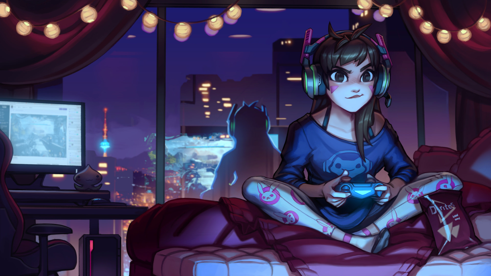

# Test Images Analysis

This document provides detailed color analysis of all test images using the sophisticated 27-category extraction system. Each image is processed through the category-based color extraction pipeline with multi-dimensional scoring.

Generated by `go run tools/analyze-images/main.go`

## abstract.jpeg

**Dimensions**: 2880 x 1800 px

### Category Analysis

**Category Coverage**: 29.6% (8 of 27 categories)

#### Core UI Elements

| Category | Hex | Visual | Candidates |
|----------|-----|--------|-----------|
| background | `#202020` | ⬛ | 0 |
| dim_foreground | `#5AA6A3` | ◻️ | 2 |
| cursor | `#97D5AE` | ◻️ | 5 |

#### Terminal Bright Colors (ANSI 8-15)

| Category | Hex | Visual | Candidates |
|----------|-----|--------|-----------|
| bright_red | `#F48D6C` | ◻️ | 5 |
| bright_yellow | `#F8DC9F` | ⬜ | 5 |

#### Accent Colors

| Category | Hex | Visual | Candidates |
|----------|-----|--------|-----------|
| accent_primary | `#F39C71` | ◻️ | 5 |
| accent_secondary | `#E46159` | ⬛ | 5 |
| accent_tertiary | `#D55459` | ⬛ | 5 |

### Core Colors Summary

| Role | Hex | Visual |
|------|-----|--------|
| Background | `#202020` | ⬛ |
| Primary Accent | `#F39C71` | ◻️ |

### Profile Analysis

| Property | Value |
|----------|-------|
| Mode | Dark |
| Color Scheme |  |
| Dominant Hue | 56.0° |
| Hue Variance | 71.4° |
| Average Luminance | 0.461 |
| Average Saturation | 0.654 |
| Grayscale? | false |
| Monochromatic? | false |
| Total Colors | 227 |
| Total Pixels | 5184000 |

## bokeh.jpeg

**Dimensions**: 4102 x 2735 px

### Category Analysis

**Category Coverage**: 22.2% (6 of 27 categories)

#### Core UI Elements

| Category | Hex | Visual | Candidates |
|----------|-----|--------|-----------|
| background | `#202020` | ⬛ | 0 |
| foreground | `#FDFDFD` | ⬜ | 1 |
| cursor | `#FDFDFD` | ⬜ | 1 |

#### Terminal Normal Colors (ANSI 0-7)

| Category | Hex | Visual | Candidates |
|----------|-----|--------|-----------|
| normal_cyan | `#0071B7` | ⬛ | 5 |

#### Terminal Bright Colors (ANSI 8-15)

| Category | Hex | Visual | Candidates |
|----------|-----|--------|-----------|
| bright_white | `#FDFDFD` | ⬜ | 1 |

#### Semantic Colors

| Category | Hex | Visual | Candidates |
|----------|-----|--------|-----------|
| info | `#0071B7` | ⬛ | 4 |

### Core Colors Summary

| Role | Hex | Visual |
|------|-----|--------|
| Background | `#202020` | ⬛ |
| Foreground | `#FDFDFD` | ⬜ |

### Profile Analysis

| Property | Value |
|----------|-------|
| Mode | Dark |
| Color Scheme |  |
| Dominant Hue | 77.9° |
| Hue Variance | 54.9° |
| Average Luminance | 0.049 |
| Average Saturation | 0.977 |
| Grayscale? | false |
| Monochromatic? | false |
| Total Colors | 87 |
| Total Pixels | 11218970 |

## coast.jpeg

**Dimensions**: 1920 x 1080 px

### Category Analysis

**Category Coverage**: 3.7% (1 of 27 categories)

#### Core UI Elements

| Category | Hex | Visual | Candidates |
|----------|-----|--------|-----------|
| background | `#FFFFFF` | ⬜ | 0 |

### Core Colors Summary

| Role | Hex | Visual |
|------|-----|--------|
| Background | `#FFFFFF` | ⬜ |

### Profile Analysis

| Property | Value |
|----------|-------|
| Mode | Light |
| Color Scheme |  |
| Dominant Hue | 180.0° |
| Hue Variance | 0.0° |
| Average Luminance | 0.998 |
| Average Saturation | 0.667 |
| Grayscale? | false |
| Monochromatic? | true |
| Total Colors | 3 |
| Total Pixels | 2073600 |

## concept-art-2.jpeg

**Dimensions**: 1920 x 1080 px

### Category Analysis

**Category Coverage**: 7.4% (2 of 27 categories)

#### Core UI Elements

| Category | Hex | Visual | Candidates |
|----------|-----|--------|-----------|
| background | `#202020` | ⬛ | 0 |
| dim_foreground | `#686791` | ⬛ | 1 |

### Core Colors Summary

| Role | Hex | Visual |
|------|-----|--------|
| Background | `#202020` | ⬛ |

### Profile Analysis

| Property | Value |
|----------|-------|
| Mode | Dark |
| Color Scheme |  |
| Dominant Hue | 266.8° |
| Hue Variance | 25.7° |
| Average Luminance | 0.017 |
| Average Saturation | 0.495 |
| Grayscale? | false |
| Monochromatic? | false |
| Total Colors | 56 |
| Total Pixels | 2073600 |

## concept-art.jpeg

**Dimensions**: 1920 x 1110 px

### Category Analysis

**Category Coverage**: 3.7% (1 of 27 categories)

#### Core UI Elements

| Category | Hex | Visual | Candidates |
|----------|-----|--------|-----------|
| background | `#15120F` | ⬛ | 0 |

### Core Colors Summary

| Role | Hex | Visual |
|------|-----|--------|
| Background | `#15120F` | ⬛ |

### Profile Analysis

| Property | Value |
|----------|-------|
| Mode | Dark |
| Color Scheme |  |
| Dominant Hue | 29.0° |
| Hue Variance | 18.1° |
| Average Luminance | 0.015 |
| Average Saturation | 0.253 |
| Grayscale? | false |
| Monochromatic? | false |
| Total Colors | 103 |
| Total Pixels | 2131200 |

## grayscale.jpeg

**Dimensions**: 1920 x 1080 px

### Category Analysis

**Category Coverage**: 29.6% (8 of 27 categories)

#### Core UI Elements

| Category | Hex | Visual | Candidates |
|----------|-----|--------|-----------|
| background | `#161616` | ⬛ | 0 |
| foreground | `#FAFAFA` | ⬜ | 1 |
| dim_foreground | `#808080` | ◻️ | 5 |
| cursor | `#FAFAFA` | ⬜ | 4 |

#### Terminal Normal Colors (ANSI 0-7)

| Category | Hex | Visual | Candidates |
|----------|-----|--------|-----------|
| normal_black | `#373737` | ⬛ | 5 |
| normal_white | `#B3B3B3` | ◻️ | 5 |

#### Terminal Bright Colors (ANSI 8-15)

| Category | Hex | Visual | Candidates |
|----------|-----|--------|-----------|
| bright_black | `#4D4D4D` | ⬛ | 5 |
| bright_white | `#FAFAFA` | ⬜ | 1 |

### Core Colors Summary

| Role | Hex | Visual |
|------|-----|--------|
| Background | `#161616` | ⬛ |
| Foreground | `#FAFAFA` | ⬜ |

### Profile Analysis

| Property | Value |
|----------|-------|
| Mode | Dark |
| Color Scheme |  |
| Dominant Hue | NaN° |
| Hue Variance | 0.0° |
| Average Luminance | 0.156 |
| Average Saturation | 0.000 |
| Grayscale? | true |
| Monochromatic? | false |
| Total Colors | 177 |
| Total Pixels | 2073600 |

## monochrome.jpeg

**Dimensions**: 1920 x 1080 px

### Category Analysis

**Category Coverage**: 14.8% (4 of 27 categories)

#### Core UI Elements

| Category | Hex | Visual | Candidates |
|----------|-----|--------|-----------|
| background | `#191919` | ⬛ | 0 |
| foreground | `#FFFFFF` | ⬜ | 1 |
| cursor | `#FFFFFF` | ⬜ | 1 |

#### Terminal Bright Colors (ANSI 8-15)

| Category | Hex | Visual | Candidates |
|----------|-----|--------|-----------|
| bright_white | `#FFFFFF` | ⬜ | 1 |

### Core Colors Summary

| Role | Hex | Visual |
|------|-----|--------|
| Background | `#191919` | ⬛ |
| Foreground | `#FFFFFF` | ⬜ |

### Profile Analysis

| Property | Value |
|----------|-------|
| Mode | Dark |
| Color Scheme |  |
| Dominant Hue | NaN° |
| Hue Variance | 0.0° |
| Average Luminance | 0.175 |
| Average Saturation | 0.000 |
| Grayscale? | true |
| Monochromatic? | false |
| Total Colors | 6 |
| Total Pixels | 2073600 |

## mountains.jpeg

**Dimensions**: 1920 x 1080 px

### Category Analysis

**Category Coverage**: 29.6% (8 of 27 categories)

#### Core UI Elements

| Category | Hex | Visual | Candidates |
|----------|-----|--------|-----------|
| background | `#000000` | ⬛ | 0 |
| foreground | `#FEFEFE` | ⬜ | 4 |
| cursor | `#F5F9F9` | ⬜ | 5 |

#### Terminal Bright Colors (ANSI 8-15)

| Category | Hex | Visual | Candidates |
|----------|-----|--------|-----------|
| bright_cyan | `#50A9E1` | ◻️ | 1 |
| bright_white | `#FEFEFE` | ⬜ | 4 |

#### Accent Colors

| Category | Hex | Visual | Candidates |
|----------|-----|--------|-----------|
| accent_primary | `#50A9E1` | ◻️ | 1 |
| accent_secondary | `#50A9E1` | ◻️ | 1 |
| accent_tertiary | `#50A9E1` | ◻️ | 1 |

### Core Colors Summary

| Role | Hex | Visual |
|------|-----|--------|
| Background | `#000000` | ⬛ |
| Foreground | `#FEFEFE` | ⬜ |
| Primary Accent | `#50A9E1` | ◻️ |

### Profile Analysis

| Property | Value |
|----------|-------|
| Mode | Dark |
| Color Scheme |  |
| Dominant Hue | 160.9° |
| Hue Variance | 38.0° |
| Average Luminance | 0.380 |
| Average Saturation | 0.588 |
| Grayscale? | false |
| Monochromatic? | false |
| Total Colors | 39 |
| Total Pixels | 2073600 |

## nebula.jpeg

**Dimensions**: 3840 x 2160 px

### Category Analysis

**Category Coverage**: 3.7% (1 of 27 categories)

#### Core UI Elements

| Category | Hex | Visual | Candidates |
|----------|-----|--------|-----------|
| background | `#202020` | ⬛ | 0 |

### Core Colors Summary

| Role | Hex | Visual |
|------|-----|--------|
| Background | `#202020` | ⬛ |

### Profile Analysis

| Property | Value |
|----------|-------|
| Mode | Dark |
| Color Scheme |  |
| Dominant Hue | 306.0° |
| Hue Variance | 7.0° |
| Average Luminance | 0.009 |
| Average Saturation | 0.451 |
| Grayscale? | false |
| Monochromatic? | false |
| Total Colors | 195 |
| Total Pixels | 8294400 |

## night-city.jpeg

**Dimensions**: 2559 x 1599 px

### Category Analysis

**Category Coverage**: 3.7% (1 of 27 categories)

#### Core UI Elements

| Category | Hex | Visual | Candidates |
|----------|-----|--------|-----------|
| background | `#000000` | ⬛ | 0 |

### Core Colors Summary

| Role | Hex | Visual |
|------|-----|--------|
| Background | `#000000` | ⬛ |

### Profile Analysis

| Property | Value |
|----------|-------|
| Mode | Dark |
| Color Scheme |  |
| Dominant Hue | 177.1° |
| Hue Variance | 6.2° |
| Average Luminance | 0.010 |
| Average Saturation | 0.604 |
| Grayscale? | false |
| Monochromatic? | false |
| Total Colors | 131 |
| Total Pixels | 4091841 |

## portal.jpeg

**Dimensions**: 1920 x 1080 px

### Category Analysis

**Category Coverage**: 7.4% (2 of 27 categories)

#### Core UI Elements

| Category | Hex | Visual | Candidates |
|----------|-----|--------|-----------|
| background | `#FFFFFF` | ⬜ | 0 |

#### Accent Colors

| Category | Hex | Visual | Candidates |
|----------|-----|--------|-----------|
| accent_primary | `#FF1E02` | ⬛ | 5 |

### Core Colors Summary

| Role | Hex | Visual |
|------|-----|--------|
| Background | `#FFFFFF` | ⬜ |
| Primary Accent | `#FF1E02` | ⬛ |

### Profile Analysis

| Property | Value |
|----------|-------|
| Mode | Light |
| Color Scheme |  |
| Dominant Hue | 18.2° |
| Hue Variance | 13.0° |
| Average Luminance | 0.505 |
| Average Saturation | 0.996 |
| Grayscale? | false |
| Monochromatic? | false |
| Total Colors | 31 |
| Total Pixels | 2073600 |

## primary-background.png

**Dimensions**: 2560 x 1600 px

### Category Analysis

**Category Coverage**: 14.8% (4 of 27 categories)

#### Core UI Elements

| Category | Hex | Visual | Candidates |
|----------|-----|--------|-----------|
| background | `#202020` | ⬛ | 0 |

#### Terminal Normal Colors (ANSI 0-7)

| Category | Hex | Visual | Candidates |
|----------|-----|--------|-----------|
| normal_cyan | `#19B383` | ◻️ | 1 |

#### Accent Colors

| Category | Hex | Visual | Candidates |
|----------|-----|--------|-----------|
| accent_secondary | `#19B383` | ◻️ | 1 |
| accent_tertiary | `#19B383` | ◻️ | 1 |

### Core Colors Summary

| Role | Hex | Visual |
|------|-----|--------|
| Background | `#202020` | ⬛ |

### Profile Analysis

| Property | Value |
|----------|-------|
| Mode | Dark |
| Color Scheme |  |
| Dominant Hue | 161.3° |
| Hue Variance | 0.0° |
| Average Luminance | 0.341 |
| Average Saturation | 0.755 |
| Grayscale? | false |
| Monochromatic? | true |
| Total Colors | 1 |
| Total Pixels | 4096000 |

## sepia.jpeg

**Dimensions**: 1920 x 1080 px

### Category Analysis

**Category Coverage**: 3.7% (1 of 27 categories)

#### Core UI Elements

| Category | Hex | Visual | Candidates |
|----------|-----|--------|-----------|
| background | `#202020` | ⬛ | 0 |

### Core Colors Summary

| Role | Hex | Visual |
|------|-----|--------|
| Background | `#202020` | ⬛ |

### Profile Analysis

| Property | Value |
|----------|-------|
| Mode | Dark |
| Color Scheme |  |
| Dominant Hue | 34.6° |
| Hue Variance | 0.7° |
| Average Luminance | 0.408 |
| Average Saturation | 0.416 |
| Grayscale? | false |
| Monochromatic? | true |
| Total Colors | 48 |
| Total Pixels | 2073600 |

## simple.png

**Dimensions**: 5120 x 2880 px

### Category Analysis

**Category Coverage**: 14.8% (4 of 27 categories)

#### Core UI Elements

| Category | Hex | Visual | Candidates |
|----------|-----|--------|-----------|
| background | `#FFFFFF` | ⬜ | 0 |
| foreground | `#0F0F0F` | ⬛ | 1 |
| cursor | `#0F0F0F` | ⬛ | 1 |

#### Terminal Normal Colors (ANSI 0-7)

| Category | Hex | Visual | Candidates |
|----------|-----|--------|-----------|
| normal_black | `#0F0F0F` | ⬛ | 1 |

### Core Colors Summary

| Role | Hex | Visual |
|------|-----|--------|
| Background | `#FFFFFF` | ⬜ |
| Foreground | `#0F0F0F` | ⬛ |

### Profile Analysis

| Property | Value |
|----------|-------|
| Mode | Light |
| Color Scheme |  |
| Dominant Hue | NaN° |
| Hue Variance | 0.0° |
| Average Luminance | 0.502 |
| Average Saturation | 0.000 |
| Grayscale? | true |
| Monochromatic? | false |
| Total Colors | 2 |
| Total Pixels | 14745600 |

## warm.jpeg

**Dimensions**: 2048 x 1365 px

### Category Analysis

**Category Coverage**: 3.7% (1 of 27 categories)

#### Core UI Elements

| Category | Hex | Visual | Candidates |
|----------|-----|--------|-----------|
| background | `#202020` | ⬛ | 0 |

### Core Colors Summary

| Role | Hex | Visual |
|------|-----|--------|
| Background | `#202020` | ⬛ |

### Profile Analysis

| Property | Value |
|----------|-------|
| Mode | Dark |
| Color Scheme |  |
| Dominant Hue | 9.4° |
| Hue Variance | 0.0° |
| Average Luminance | 0.037 |
| Average Saturation | 0.276 |
| Grayscale? | false |
| Monochromatic? | true |
| Total Colors | 1 |
| Total Pixels | 2795520 |

