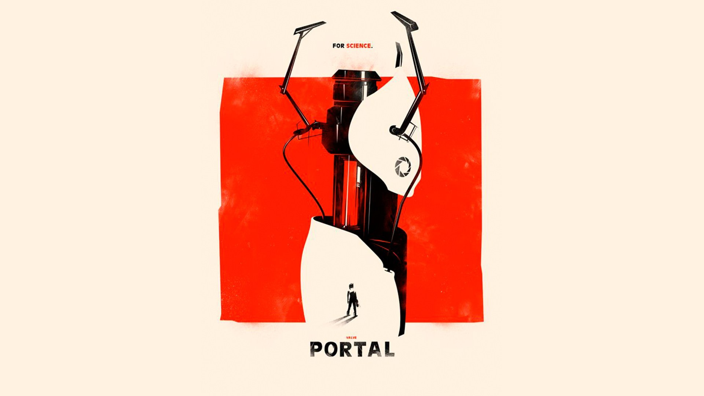

# Test Images Analysis

This document provides detailed color analysis of all test images using the sophisticated 27-category extraction system. Each image is processed through the category-based color extraction pipeline with multi-dimensional scoring.

Generated by `go run tools/analyze-images/main.go`

## abstract.jpeg

**Dimensions**: 2880 x 1800 px

### Category Analysis

**Category Coverage**: 48.1% (13 of 27 categories)

#### Core UI Elements

| Category | Selected | Visual | Candidates (score) |
|----------|----------|--------|-------------------|
| background | `#FFFFFF` |  | - |
| dim_foreground | `#56A2A0` |  | `#56A2A0` (0.39) `#5AA6A3` (0.38) `#55A0A5` (0.37)+2 more |
| cursor | `#95224F` |  | `#95224F` (0.34) `#94214E` (0.33) `#94234F` (0.33)+2 more |

#### Terminal Normal Colors (ANSI 0-7)

| Category | Selected | Visual | Candidates (score) |
|----------|----------|--------|-------------------|
| normal_red | `#95224F` |  | `#95224F` (0.54) `#94214E` (0.54) `#97214F` (0.53)+2 more |
| normal_magenta | `#95224F` |  | `#95224F` (0.52) `#94214E` (0.52) `#97214F` (0.51)+2 more |
| normal_cyan | `#55A0A5` |  | `#55A0A5` (0.42) `#549FA4` (0.42) `#529DA2` (0.41)+2 more |

#### Terminal Bright Colors (ANSI 8-15)

| Category | Selected | Visual | Candidates (score) |
|----------|----------|--------|-------------------|
| bright_red | `#95224F` |  | `#95224F` (0.38) `#94214E` (0.37) `#97214F` (0.37)+2 more |
| bright_magenta | `#95224F` |  | `#95224F` (0.38) `#94214E` (0.37) `#97214F` (0.37)+2 more |

#### Accent Colors

| Category | Selected | Visual | Candidates (score) |
|----------|----------|--------|-------------------|
| accent_primary | `#95224F` |  | `#95224F` (0.47) `#AA224E` (0.47) `#97214F` (0.47)+2 more |
| accent_secondary | `#95224F` |  | `#95224F` (0.49) `#94214E` (0.48) `#D8555A` (0.47)+2 more |
| accent_tertiary | `#D55459` |  | `#D55459` (0.50) `#D8555A` (0.49) `#D35257` (0.49)+2 more |

#### Semantic Colors

| Category | Selected | Visual | Candidates (score) |
|----------|----------|--------|-------------------|
| error | `#AA224E` |  | `#AA224E` (0.51) `#A6234F` (0.50) `#AB224E` (0.50)+2 more |
| info | `#55A0A5` |  | `#55A0A5` (0.34) `#549FA4` (0.34) `#529DA2` (0.33)+2 more |

### Core Colors Summary

| Role | Hex | Visual |
|------|-----|--------|
| Background | `#FFFFFF` |  |
| Primary Accent | `#95224F` |  |
| Error | `#AA224E` |  |

### Profile Analysis

| Property | Value |
|----------|-------|
| Mode | Light |
| Dominant Hue | 45.9° |
| Hue Variance | 64.4° |
| Average Luminance | 0.511 |
| Average Saturation | 0.691 |
| Grayscale? | false |
| Monochromatic? | false |
| Total Colors | 807 |
| Total Pixels | 5184000 |

### Color Candidates Detail

*Top candidates for categories with multiple options:*

**dim_foreground** (5 candidates):
| Rank | Color | Visual | Frequency | Score |
|------|-------|--------|-----------|-------|
| **1** ✓ | `#56A2A0` |  | 0.6553% | 0.392 |
| 2 | `#5AA6A3` |  | 0.5486% | 0.379 |
| 3 | `#55A0A5` |  | 0.4256% | 0.373 |
| 4 | `#5BA8A2` |  | 0.5658% | 0.372 |
| 5 | `#5EABA3` |  | 0.7890% | 0.369 |

**cursor** (5 candidates):
| Rank | Color | Visual | Frequency | Score |
|------|-------|--------|-----------|-------|
| **1** ✓ | `#95224F` |  | 0.0398% | 0.342 |
| 2 | `#94214E` |  | 0.0223% | 0.333 |
| 3 | `#94234F` |  | 0.0171% | 0.330 |
| 4 | `#93224E` |  | 0.0139% | 0.328 |
| 5 | `#93244F` |  | 0.0117% | 0.327 |

**normal_red** (5 candidates):
| Rank | Color | Visual | Frequency | Score |
|------|-------|--------|-----------|-------|
| **1** ✓ | `#95224F` |  | 0.0398% | 0.540 |
| 2 | `#94214E` |  | 0.0223% | 0.535 |
| 3 | `#97214F` |  | 0.0229% | 0.531 |
| 4 | `#97224D` |  | 0.0159% | 0.525 |
| 5 | `#96204E` |  | 0.0108% | 0.525 |

**normal_magenta** (5 candidates):
| Rank | Color | Visual | Frequency | Score |
|------|-------|--------|-----------|-------|
| **1** ✓ | `#95224F` |  | 0.0398% | 0.521 |
| 2 | `#94214E` |  | 0.0223% | 0.516 |
| 3 | `#97214F` |  | 0.0229% | 0.511 |
| 4 | `#93224E` |  | 0.0139% | 0.505 |
| 5 | `#96204E` |  | 0.0108% | 0.505 |

**normal_cyan** (5 candidates):
| Rank | Color | Visual | Frequency | Score |
|------|-------|--------|-----------|-------|
| **1** ✓ | `#55A0A5` |  | 0.4256% | 0.424 |
| 2 | `#549FA4` |  | 0.3100% | 0.420 |
| 3 | `#529DA2` |  | 0.1832% | 0.413 |
| 4 | `#55A19F` |  | 0.1484% | 0.406 |
| 5 | `#539EA3` |  | 0.1220% | 0.399 |

**bright_red** (5 candidates):
| Rank | Color | Visual | Frequency | Score |
|------|-------|--------|-----------|-------|
| **1** ✓ | `#95224F` |  | 0.0398% | 0.378 |
| 2 | `#94214E` |  | 0.0223% | 0.374 |
| 3 | `#97214F` |  | 0.0229% | 0.371 |
| 4 | `#96204E` |  | 0.0108% | 0.366 |
| 5 | `#97224D` |  | 0.0159% | 0.364 |

**bright_magenta** (5 candidates):
| Rank | Color | Visual | Frequency | Score |
|------|-------|--------|-----------|-------|
| **1** ✓ | `#95224F` |  | 0.0398% | 0.379 |
| 2 | `#94214E` |  | 0.0223% | 0.375 |
| 3 | `#97214F` |  | 0.0229% | 0.370 |
| 4 | `#96204E` |  | 0.0108% | 0.364 |
| 5 | `#93224E` |  | 0.0139% | 0.362 |

**accent_primary** (5 candidates):
| Rank | Color | Visual | Frequency | Score |
|------|-------|--------|-----------|-------|
| **1** ✓ | `#95224F` |  | 0.0398% | 0.473 |
| 2 | `#AA224E` |  | 0.0315% | 0.469 |
| 3 | `#97214F` |  | 0.0229% | 0.465 |
| 4 | `#A6234F` |  | 0.0309% | 0.465 |
| 5 | `#94214E` |  | 0.0223% | 0.465 |

**accent_secondary** (5 candidates):
| Rank | Color | Visual | Frequency | Score |
|------|-------|--------|-----------|-------|
| **1** ✓ | `#95224F` |  | 0.0398% | 0.490 |
| 2 | `#94214E` |  | 0.0223% | 0.477 |
| 3 | `#D8555A` |  | 0.5963% | 0.475 |
| 4 | `#97214F` |  | 0.0229% | 0.474 |
| 5 | `#94234F` |  | 0.0171% | 0.473 |

**accent_tertiary** (5 candidates):
| Rank | Color | Visual | Frequency | Score |
|------|-------|--------|-----------|-------|
| **1** ✓ | `#D55459` |  | 0.4807% | 0.497 |
| 2 | `#D8555A` |  | 0.5963% | 0.491 |
| 3 | `#D35257` |  | 0.2624% | 0.490 |
| 4 | `#D9565B` |  | 0.4482% | 0.479 |
| 5 | `#D45358` |  | 0.1682% | 0.474 |

**error** (5 candidates):
| Rank | Color | Visual | Frequency | Score |
|------|-------|--------|-----------|-------|
| **1** ✓ | `#AA224E` |  | 0.0315% | 0.506 |
| 2 | `#A6234F` |  | 0.0309% | 0.497 |
| 3 | `#AB224E` |  | 0.0192% | 0.495 |
| 4 | `#A9214D` |  | 0.0116% | 0.490 |
| 5 | `#AF214F` |  | 0.0144% | 0.488 |

**info** (5 candidates):
| Rank | Color | Visual | Frequency | Score |
|------|-------|--------|-----------|-------|
| **1** ✓ | `#55A0A5` |  | 0.4256% | 0.340 |
| 2 | `#549FA4` |  | 0.3100% | 0.335 |
| 3 | `#529DA2` |  | 0.1832% | 0.329 |
| 4 | `#539EA3` |  | 0.1220% | 0.315 |
| 5 | `#519CA1` |  | 0.0398% | 0.296 |

## bokeh.jpeg

**Dimensions**: 4102 x 2735 px

### Category Analysis

**Category Coverage**: 59.3% (16 of 27 categories)

#### Core UI Elements

| Category | Selected | Visual | Candidates (score) |
|----------|----------|--------|-------------------|
| background | `#36333A` |  | - |
| foreground | `#FDFDFD` |  | `#FDFDFD` (0.52) `#FEFEFE` (0.46) `#FCFCFC` (0.44) |
| dim_foreground | `#707690` |  | `#707690` (0.35) `#717791` (0.35) `#6F758F` (0.35)+2 more |
| cursor | `#FDFDFD` |  | `#FDFDFD` (0.48) `#FEFEFE` (0.42) `#FCFCFC` (0.40) |

#### Terminal Normal Colors (ANSI 0-7)

| Category | Selected | Visual | Candidates (score) |
|----------|----------|--------|-------------------|
| normal_black | `#494248` |  | `#494248` (0.27) `#4A4349` (0.27) `#4C464E` (0.26)+2 more |
| normal_blue | `#3379B5` |  | `#3379B5` (0.40) `#1F71B1` (0.39) `#245D92` (0.38)+2 more |
| normal_cyan | `#3379B5` |  | `#3379B5` (0.42) `#1F71B1` (0.41) `#1E70B0` (0.41)+2 more |
| normal_white | `#7D7D95` |  | `#7D7D95` (0.31) |

#### Terminal Bright Colors (ANSI 8-15)

| Category | Selected | Visual | Candidates (score) |
|----------|----------|--------|-------------------|
| bright_black | `#5B504C` |  | `#5B504C` (0.34) `#5C514D` (0.34) `#574D4A` (0.34)+2 more |
| bright_blue | `#3379B5` |  | `#3379B5` (0.27) |
| bright_cyan | `#3379B5` |  | `#3379B5` (0.32) |
| bright_white | `#FDFDFD` |  | `#FDFDFD` (0.51) `#FEFEFE` (0.45) `#FCFCFC` (0.43) |

#### Accent Colors

| Category | Selected | Visual | Candidates (score) |
|----------|----------|--------|-------------------|
| accent_primary | `#3379B5` |  | `#3379B5` (0.30) `#0074BD` (0.25) `#0078C2` (0.25)+2 more |
| accent_secondary | `#3379B5` |  | `#3379B5` (0.35) `#1F71B1` (0.33) `#1E70B0` (0.33)+2 more |
| accent_tertiary | `#3379B5` |  | `#3379B5` (0.39) `#275D91` (0.37) `#265C90` (0.37)+2 more |

#### Semantic Colors

| Category | Selected | Visual | Candidates (score) |
|----------|----------|--------|-------------------|
| info | `#3379B5` |  | `#3379B5` (0.49) `#0074BD` (0.40) `#0078C2` (0.40)+2 more |

### Core Colors Summary

| Role | Hex | Visual |
|------|-----|--------|
| Background | `#36333A` |  |
| Foreground | `#FDFDFD` |  |
| Primary Accent | `#3379B5` |  |

### Profile Analysis

| Property | Value |
|----------|-------|
| Mode | Dark |
| Dominant Hue | 80.3° |
| Hue Variance | 80.0° |
| Average Luminance | 0.067 |
| Average Saturation | 0.682 |
| Grayscale? | false |
| Monochromatic? | false |
| Total Colors | 1531 |
| Total Pixels | 11218970 |

### Color Candidates Detail

*Top candidates for categories with multiple options:*

**foreground** (3 candidates):
| Rank | Color | Visual | Frequency | Score |
|------|-------|--------|-----------|-------|
| **1** ✓ | `#FDFDFD` |  | 0.6342% | 0.522 |
| 2 | `#FEFEFE` |  | 0.0539% | 0.460 |
| 3 | `#FCFCFC` |  | 0.0204% | 0.439 |

**dim_foreground** (5 candidates):
| Rank | Color | Visual | Frequency | Score |
|------|-------|--------|-----------|-------|
| **1** ✓ | `#707690` |  | 0.0244% | 0.352 |
| 2 | `#717791` |  | 0.0218% | 0.349 |
| 3 | `#6F758F` |  | 0.0203% | 0.348 |
| 4 | `#6D728F` |  | 0.0211% | 0.348 |
| 5 | `#6E7390` |  | 0.0183% | 0.348 |

**cursor** (3 candidates):
| Rank | Color | Visual | Frequency | Score |
|------|-------|--------|-----------|-------|
| **1** ✓ | `#FDFDFD` |  | 0.6342% | 0.484 |
| 2 | `#FEFEFE` |  | 0.0539% | 0.422 |
| 3 | `#FCFCFC` |  | 0.0204% | 0.400 |

**normal_black** (5 candidates):
| Rank | Color | Visual | Frequency | Score |
|------|-------|--------|-----------|-------|
| **1** ✓ | `#494248` |  | 0.0104% | 0.267 |
| 2 | `#4A4349` |  | 0.0119% | 0.266 |
| 3 | `#4C464E` |  | 0.0110% | 0.260 |
| 4 | `#4D474F` |  | 0.0110% | 0.257 |
| 5 | `#494449` |  | 0.0152% | 0.256 |

**normal_blue** (5 candidates):
| Rank | Color | Visual | Frequency | Score |
|------|-------|--------|-----------|-------|
| **1** ✓ | `#3379B5` |  | 0.0104% | 0.400 |
| 2 | `#1F71B1` |  | 0.0106% | 0.385 |
| 3 | `#245D92` |  | 0.0359% | 0.385 |
| 4 | `#215E95` |  | 0.0236% | 0.384 |
| 5 | `#1E70B0` |  | 0.0131% | 0.384 |

**normal_cyan** (5 candidates):
| Rank | Color | Visual | Frequency | Score |
|------|-------|--------|-----------|-------|
| **1** ✓ | `#3379B5` |  | 0.0104% | 0.418 |
| 2 | `#1F71B1` |  | 0.0106% | 0.413 |
| 3 | `#1E70B0` |  | 0.0131% | 0.412 |
| 4 | `#1D71B0` |  | 0.0105% | 0.408 |
| 5 | `#1C70AF` |  | 0.0137% | 0.408 |

**bright_black** (5 candidates):
| Rank | Color | Visual | Frequency | Score |
|------|-------|--------|-----------|-------|
| **1** ✓ | `#5B504C` |  | 0.0121% | 0.343 |
| 2 | `#5C514D` |  | 0.0124% | 0.340 |
| 3 | `#574D4A` |  | 0.0100% | 0.338 |
| 4 | `#535063` |  | 0.0109% | 0.328 |
| 5 | `#545369` |  | 0.0184% | 0.314 |

**bright_white** (3 candidates):
| Rank | Color | Visual | Frequency | Score |
|------|-------|--------|-----------|-------|
| **1** ✓ | `#FDFDFD` |  | 0.6342% | 0.510 |
| 2 | `#FEFEFE` |  | 0.0539% | 0.448 |
| 3 | `#FCFCFC` |  | 0.0204% | 0.426 |

**accent_primary** (5 candidates):
| Rank | Color | Visual | Frequency | Score |
|------|-------|--------|-----------|-------|
| **1** ✓ | `#3379B5` |  | 0.0104% | 0.299 |
| 2 | `#0074BD` |  | 0.0687% | 0.252 |
| 3 | `#0078C2` |  | 0.0519% | 0.252 |
| 4 | `#0077C1` |  | 0.0514% | 0.250 |
| 5 | `#0076C0` |  | 0.0384% | 0.243 |

**accent_secondary** (5 candidates):
| Rank | Color | Visual | Frequency | Score |
|------|-------|--------|-----------|-------|
| **1** ✓ | `#3379B5` |  | 0.0104% | 0.353 |
| 2 | `#1F71B1` |  | 0.0106% | 0.328 |
| 3 | `#1E70B0` |  | 0.0131% | 0.327 |
| 4 | `#1D71B0` |  | 0.0105% | 0.321 |
| 5 | `#1C70AF` |  | 0.0137% | 0.321 |

**accent_tertiary** (5 candidates):
| Rank | Color | Visual | Frequency | Score |
|------|-------|--------|-----------|-------|
| **1** ✓ | `#3379B5` |  | 0.0104% | 0.393 |
| 2 | `#275D91` |  | 0.0312% | 0.369 |
| 3 | `#265C90` |  | 0.0321% | 0.366 |
| 4 | `#295C91` |  | 0.0308% | 0.365 |
| 5 | `#285B90` |  | 0.0294% | 0.364 |

**info** (5 candidates):
| Rank | Color | Visual | Frequency | Score |
|------|-------|--------|-----------|-------|
| **1** ✓ | `#3379B5` |  | 0.0104% | 0.488 |
| 2 | `#0074BD` |  | 0.0687% | 0.401 |
| 3 | `#0078C2` |  | 0.0519% | 0.400 |
| 4 | `#0077C1` |  | 0.0514% | 0.399 |
| 5 | `#0076C0` |  | 0.0384% | 0.391 |

## coast.jpeg

**Dimensions**: 1920 x 1080 px

### Category Analysis

**Category Coverage**: 14.8% (4 of 27 categories)

#### Core UI Elements

| Category | Selected | Visual | Candidates (score) |
|----------|----------|--------|-------------------|
| background | `#000000` |  | - |
| foreground | `#FFFFFF` |  | `#FFFFFF` (0.54) `#FEFEFE` (0.47) `#FDFDFD` (0.45) |
| cursor | `#FFFFFF` |  | `#FFFFFF` (0.54) `#FEFEFE` (0.47) `#FDFDFD` (0.45) |

#### Terminal Bright Colors (ANSI 8-15)

| Category | Selected | Visual | Candidates (score) |
|----------|----------|--------|-------------------|
| bright_white | `#FFFFFF` |  | `#FFFFFF` (0.54) `#FEFEFE` (0.47) `#FDFDFD` (0.45) |

### Core Colors Summary

| Role | Hex | Visual |
|------|-----|--------|
| Background | `#000000` |  |
| Foreground | `#FFFFFF` |  |

### Profile Analysis

| Property | Value |
|----------|-------|
| Mode | Dark |
| Dominant Hue | 6.6° |
| Hue Variance | 99.0° |
| Average Luminance | 0.398 |
| Average Saturation | 0.886 |
| Grayscale? | false |
| Monochromatic? | false |
| Total Colors | 206 |
| Total Pixels | 2073600 |

### Color Candidates Detail

*Top candidates for categories with multiple options:*

**foreground** (3 candidates):
| Rank | Color | Visual | Frequency | Score |
|------|-------|--------|-----------|-------|
| **1** ✓ | `#FFFFFF` |  | 0.6585% | 0.539 |
| 2 | `#FEFEFE` |  | 0.0352% | 0.468 |
| 3 | `#FDFDFD` |  | 0.0129% | 0.451 |

**cursor** (3 candidates):
| Rank | Color | Visual | Frequency | Score |
|------|-------|--------|-----------|-------|
| **1** ✓ | `#FFFFFF` |  | 0.6585% | 0.539 |
| 2 | `#FEFEFE` |  | 0.0352% | 0.467 |
| 3 | `#FDFDFD` |  | 0.0129% | 0.450 |

**bright_white** (3 candidates):
| Rank | Color | Visual | Frequency | Score |
|------|-------|--------|-----------|-------|
| **1** ✓ | `#FFFFFF` |  | 0.6585% | 0.539 |
| 2 | `#FEFEFE` |  | 0.0352% | 0.468 |
| 3 | `#FDFDFD` |  | 0.0129% | 0.451 |

## concept-art-2.jpeg

**Dimensions**: 1920 x 1080 px

### Category Analysis

**Category Coverage**: 55.6% (15 of 27 categories)

#### Core UI Elements

| Category | Selected | Visual | Candidates (score) |
|----------|----------|--------|-------------------|
| background | `#170E1F` |  | - |
| dim_foreground | `#686791` |  | `#686791` (0.41) `#4F89AE` (0.40) `#676690` (0.37)+2 more |
| cursor | `#E8D698` |  | `#E8D698` (0.49) `#7CB8DE` (0.36) `#7AB6DC` (0.36)+2 more |

#### Terminal Normal Colors (ANSI 0-7)

| Category | Selected | Visual | Candidates (score) |
|----------|----------|--------|-------------------|
| normal_black | `#2C232C` |  | `#2C232C` (0.33) `#2B222B` (0.33) `#2A212A` (0.31) |
| normal_blue | `#8C77D2` |  | `#8C77D2` (0.48) `#345FBD` (0.48) `#8D78D3` (0.48)+2 more |
| normal_magenta | `#5A3868` |  | `#5A3868` (0.33) `#543463` (0.32) `#563464` (0.32)+2 more |
| normal_cyan | `#6FADD4` |  | `#6FADD4` (0.50) `#74B0D6` (0.49) `#70AED4` (0.49)+2 more |

#### Terminal Bright Colors (ANSI 8-15)

| Category | Selected | Visual | Candidates (score) |
|----------|----------|--------|-------------------|
| bright_black | `#5F5A70` |  | `#5F5A70` (0.33) |
| bright_yellow | `#E8D698` |  | `#E8D698` (0.64) |
| bright_blue | `#7ABEED` |  | `#7ABEED` (0.52) `#87C6F1` (0.52) `#87CEF6` (0.49)+2 more |
| bright_cyan | `#62C5F0` |  | `#62C5F0` (0.56) `#87CEF6` (0.54) `#87C6F1` (0.54)+2 more |

#### Accent Colors

| Category | Selected | Visual | Candidates (score) |
|----------|----------|--------|-------------------|
| accent_primary | `#E8D698` |  | `#E8D698` (0.54) `#87C6F1` (0.48) `#7ABEED` (0.48)+2 more |
| accent_secondary | `#7CB8DE` |  | `#7CB8DE` (0.48) `#7AB6DC` (0.47) `#79B5DB` (0.47)+2 more |
| accent_tertiary | `#7AB6DC` |  | `#7AB6DC` (0.48) `#79B5DB` (0.48) `#78B4DA` (0.48)+2 more |

#### Semantic Colors

| Category | Selected | Visual | Candidates (score) |
|----------|----------|--------|-------------------|
| info | `#6FADD4` |  | `#6FADD4` (0.53) `#74B0D6` (0.53) `#73AFD5` (0.53)+2 more |

### Core Colors Summary

| Role | Hex | Visual |
|------|-----|--------|
| Background | `#170E1F` |  |
| Primary Accent | `#E8D698` |  |

### Profile Analysis

| Property | Value |
|----------|-------|
| Mode | Dark |
| Dominant Hue | 277.2° |
| Hue Variance | 33.3° |
| Average Luminance | 0.051 |
| Average Saturation | 0.491 |
| Grayscale? | false |
| Monochromatic? | false |
| Total Colors | 1277 |
| Total Pixels | 2073600 |

### Color Candidates Detail

*Top candidates for categories with multiple options:*

**dim_foreground** (5 candidates):
| Rank | Color | Visual | Frequency | Score |
|------|-------|--------|-----------|-------|
| **1** ✓ | `#686791` |  | 0.1040% | 0.415 |
| 2 | `#4F89AE` |  | 0.0191% | 0.400 |
| 3 | `#676690` |  | 0.0175% | 0.374 |
| 4 | `#7E7786` |  | 0.0159% | 0.356 |
| 5 | `#50478C` |  | 0.0948% | 0.348 |

**cursor** (5 candidates):
| Rank | Color | Visual | Frequency | Score |
|------|-------|--------|-----------|-------|
| **1** ✓ | `#E8D698` |  | 0.0165% | 0.489 |
| 2 | `#7CB8DE` |  | 0.0105% | 0.359 |
| 3 | `#7AB6DC` |  | 0.0109% | 0.356 |
| 4 | `#79B5DB` |  | 0.0101% | 0.353 |
| 5 | `#78B4DA` |  | 0.0113% | 0.352 |

**normal_black** (3 candidates):
| Rank | Color | Visual | Frequency | Score |
|------|-------|--------|-----------|-------|
| **1** ✓ | `#2C232C` |  | 0.0186% | 0.332 |
| 2 | `#2B222B` |  | 0.0185% | 0.325 |
| 3 | `#2A212A` |  | 0.0138% | 0.314 |

**normal_blue** (5 candidates):
| Rank | Color | Visual | Frequency | Score |
|------|-------|--------|-----------|-------|
| **1** ✓ | `#8C77D2` |  | 0.0838% | 0.483 |
| 2 | `#345FBD` |  | 0.0403% | 0.483 |
| 3 | `#8D78D3` |  | 0.0747% | 0.482 |
| 4 | `#2D56B2` |  | 0.0145% | 0.466 |
| 5 | `#335EBC` |  | 0.0156% | 0.466 |

**normal_magenta** (5 candidates):
| Rank | Color | Visual | Frequency | Score |
|------|-------|--------|-----------|-------|
| **1** ✓ | `#5A3868` |  | 0.0336% | 0.335 |
| 2 | `#543463` |  | 0.0347% | 0.323 |
| 3 | `#563464` |  | 0.0200% | 0.320 |
| 4 | `#573565` |  | 0.0182% | 0.320 |
| 5 | `#583667` |  | 0.0159% | 0.317 |

**normal_cyan** (5 candidates):
| Rank | Color | Visual | Frequency | Score |
|------|-------|--------|-----------|-------|
| **1** ✓ | `#6FADD4` |  | 0.0176% | 0.495 |
| 2 | `#74B0D6` |  | 0.0117% | 0.492 |
| 3 | `#70AED4` |  | 0.0109% | 0.490 |
| 4 | `#73AFD5` |  | 0.0122% | 0.490 |
| 5 | `#72AED4` |  | 0.0111% | 0.486 |

**bright_blue** (5 candidates):
| Rank | Color | Visual | Frequency | Score |
|------|-------|--------|-----------|-------|
| **1** ✓ | `#7ABEED` |  | 0.0139% | 0.517 |
| 2 | `#87C6F1` |  | 0.0156% | 0.516 |
| 3 | `#87CEF6` |  | 0.0149% | 0.491 |
| 4 | `#97C8FF` |  | 0.0727% | 0.484 |
| 5 | `#87CEF8` |  | 0.0163% | 0.483 |

**bright_cyan** (5 candidates):
| Rank | Color | Visual | Frequency | Score |
|------|-------|--------|-----------|-------|
| **1** ✓ | `#62C5F0` |  | 0.0108% | 0.564 |
| 2 | `#87CEF6` |  | 0.0149% | 0.545 |
| 3 | `#87C6F1` |  | 0.0156% | 0.544 |
| 4 | `#7ABEED` |  | 0.0139% | 0.542 |
| 5 | `#88CFF7` |  | 0.0108% | 0.537 |

**accent_primary** (5 candidates):
| Rank | Color | Visual | Frequency | Score |
|------|-------|--------|-----------|-------|
| **1** ✓ | `#E8D698` |  | 0.0165% | 0.544 |
| 2 | `#87C6F1` |  | 0.0156% | 0.481 |
| 3 | `#7ABEED` |  | 0.0139% | 0.477 |
| 4 | `#62C5F0` |  | 0.0108% | 0.472 |
| 5 | `#87CEF6` |  | 0.0149% | 0.472 |

**accent_secondary** (5 candidates):
| Rank | Color | Visual | Frequency | Score |
|------|-------|--------|-----------|-------|
| **1** ✓ | `#7CB8DE` |  | 0.0105% | 0.476 |
| 2 | `#7AB6DC` |  | 0.0109% | 0.469 |
| 3 | `#79B5DB` |  | 0.0101% | 0.465 |
| 4 | `#78B4DA` |  | 0.0113% | 0.463 |
| 5 | `#87C6F1` |  | 0.0156% | 0.457 |

**accent_tertiary** (5 candidates):
| Rank | Color | Visual | Frequency | Score |
|------|-------|--------|-----------|-------|
| **1** ✓ | `#7AB6DC` |  | 0.0109% | 0.477 |
| 2 | `#79B5DB` |  | 0.0101% | 0.477 |
| 3 | `#78B4DA` |  | 0.0113% | 0.476 |
| 4 | `#7CB8DE` |  | 0.0105% | 0.475 |
| 5 | `#76B2D8` |  | 0.0110% | 0.470 |

**info** (5 candidates):
| Rank | Color | Visual | Frequency | Score |
|------|-------|--------|-----------|-------|
| **1** ✓ | `#6FADD4` |  | 0.0176% | 0.532 |
| 2 | `#74B0D6` |  | 0.0117% | 0.529 |
| 3 | `#73AFD5` |  | 0.0122% | 0.527 |
| 4 | `#70AED4` |  | 0.0109% | 0.523 |
| 5 | `#72AED4` |  | 0.0111% | 0.523 |

## concept-art.jpeg

**Dimensions**: 1920 x 1110 px

### Category Analysis

**Category Coverage**: 18.5% (5 of 27 categories)

#### Core UI Elements

| Category | Selected | Visual | Candidates (score) |
|----------|----------|--------|-------------------|
| background | `#15120F` |  | - |
| dim_foreground | `#757881` |  | `#757881` (0.34) `#747780` (0.33) `#73767F` (0.33)+2 more |
| cursor | `#CDD9F3` |  | `#CDD9F3` (0.53) `#CAD6F2` (0.52) `#CBD7F3` (0.52)+2 more |

#### Terminal Normal Colors (ANSI 0-7)

| Category | Selected | Visual | Candidates (score) |
|----------|----------|--------|-------------------|
| normal_black | `#38332E` |  | `#38332E` (0.40) `#37322D` (0.40) `#36312C` (0.40)+2 more |

#### Terminal Bright Colors (ANSI 8-15)

| Category | Selected | Visual | Candidates (score) |
|----------|----------|--------|-------------------|
| bright_black | `#524E43` |  | `#524E43` (0.38) `#514D42` (0.38) `#504C41` (0.38)+2 more |

### Core Colors Summary

| Role | Hex | Visual |
|------|-----|--------|
| Background | `#15120F` |  |

### Profile Analysis

| Property | Value |
|----------|-------|
| Mode | Dark |
| Dominant Hue | 28.6° |
| Hue Variance | 42.7° |
| Average Luminance | 0.043 |
| Average Saturation | 0.207 |
| Grayscale? | false |
| Monochromatic? | false |
| Total Colors | 1585 |
| Total Pixels | 2131200 |

### Color Candidates Detail

*Top candidates for categories with multiple options:*

**dim_foreground** (5 candidates):
| Rank | Color | Visual | Frequency | Score |
|------|-------|--------|-----------|-------|
| **1** ✓ | `#757881` |  | 0.0105% | 0.336 |
| 2 | `#747780` |  | 0.0104% | 0.333 |
| 3 | `#73767F` |  | 0.0107% | 0.330 |
| 4 | `#73767D` |  | 0.0106% | 0.324 |
| 5 | `#72757C` |  | 0.0104% | 0.321 |

**cursor** (5 candidates):
| Rank | Color | Visual | Frequency | Score |
|------|-------|--------|-----------|-------|
| **1** ✓ | `#CDD9F3` |  | 0.1006% | 0.527 |
| 2 | `#CAD6F2` |  | 0.0925% | 0.521 |
| 3 | `#CBD7F3` |  | 0.0907% | 0.517 |
| 4 | `#CDD6F3` |  | 0.0863% | 0.517 |
| 5 | `#D5DFF5` |  | 0.0372% | 0.516 |

**normal_black** (5 candidates):
| Rank | Color | Visual | Frequency | Score |
|------|-------|--------|-----------|-------|
| **1** ✓ | `#38332E` |  | 0.0490% | 0.404 |
| 2 | `#37322D` |  | 0.0521% | 0.403 |
| 3 | `#36312C` |  | 0.0525% | 0.398 |
| 4 | `#39342F` |  | 0.0458% | 0.398 |
| 5 | `#3A3530` |  | 0.0474% | 0.394 |

**bright_black** (5 candidates):
| Rank | Color | Visual | Frequency | Score |
|------|-------|--------|-----------|-------|
| **1** ✓ | `#524E43` |  | 0.0111% | 0.382 |
| 2 | `#514D42` |  | 0.0137% | 0.380 |
| 3 | `#504C41` |  | 0.0150% | 0.377 |
| 4 | `#514C44` |  | 0.0151% | 0.374 |
| 5 | `#504D42` |  | 0.0102% | 0.372 |

## grayscale.jpeg

**Dimensions**: 1920 x 1080 px

### Category Analysis

**Category Coverage**: 29.6% (8 of 27 categories)

#### Core UI Elements

| Category | Selected | Visual | Candidates (score) |
|----------|----------|--------|-------------------|
| background | `#161616` |  | - |
| foreground | `#DBDBDB` |  | `#DBDBDB` (0.52) `#DADADA` (0.52) `#D9D9D9` (0.52)+2 more |
| dim_foreground | `#808080` |  | `#808080` (0.40) `#7F7F7F` (0.40) `#818181` (0.40)+2 more |
| cursor | `#FAFAFA` |  | `#FAFAFA` (0.51) `#F9F9F9` (0.49) `#E6E6E6` (0.49)+2 more |

#### Terminal Normal Colors (ANSI 0-7)

| Category | Selected | Visual | Candidates (score) |
|----------|----------|--------|-------------------|
| normal_black | `#333333` |  | `#333333` (0.36) `#343434` (0.36) `#353535` (0.36)+2 more |
| normal_white | `#B3B3B3` |  | `#B3B3B3` (0.45) `#B2B2B2` (0.45) `#B4B4B4` (0.45)+2 more |

#### Terminal Bright Colors (ANSI 8-15)

| Category | Selected | Visual | Candidates (score) |
|----------|----------|--------|-------------------|
| bright_black | `#4D4D4D` |  | `#4D4D4D` (0.36) `#4C4C4C` (0.36) `#4E4E4E` (0.36)+2 more |
| bright_white | `#DEDEDE` |  | `#DEDEDE` (0.51) `#DFDFDF` (0.51) `#DDDDDD` (0.51)+2 more |

### Core Colors Summary

| Role | Hex | Visual |
|------|-----|--------|
| Background | `#161616` |  |
| Foreground | `#DBDBDB` |  |

### Profile Analysis

| Property | Value |
|----------|-------|
| Mode | Dark |
| Dominant Hue | NaN° |
| Hue Variance | 0.0° |
| Average Luminance | 0.313 |
| Average Saturation | 0.000 |
| Grayscale? | true |
| Monochromatic? | false |
| Total Colors | 254 |
| Total Pixels | 2073600 |

### Color Candidates Detail

*Top candidates for categories with multiple options:*

**foreground** (5 candidates):
| Rank | Color | Visual | Frequency | Score |
|------|-------|--------|-----------|-------|
| **1** ✓ | `#DBDBDB` |  | 0.0161% | 0.522 |
| 2 | `#DADADA` |  | 0.0144% | 0.520 |
| 3 | `#D9D9D9` |  | 0.0149% | 0.520 |
| 4 | `#DCDCDC` |  | 0.0156% | 0.519 |
| 5 | `#DEDEDE` |  | 0.0165% | 0.516 |

**dim_foreground** (5 candidates):
| Rank | Color | Visual | Frequency | Score |
|------|-------|--------|-----------|-------|
| **1** ✓ | `#808080` |  | 0.2072% | 0.397 |
| 2 | `#7F7F7F` |  | 0.2146% | 0.396 |
| 3 | `#818181` |  | 0.1988% | 0.396 |
| 4 | `#828282` |  | 0.1905% | 0.394 |
| 5 | `#838383` |  | 0.1872% | 0.393 |

**cursor** (5 candidates):
| Rank | Color | Visual | Frequency | Score |
|------|-------|--------|-----------|-------|
| **1** ✓ | `#FAFAFA` |  | 0.1515% | 0.508 |
| 2 | `#F9F9F9` |  | 0.0756% | 0.492 |
| 3 | `#E6E6E6` |  | 0.0177% | 0.489 |
| 4 | `#E5E5E5` |  | 0.0179% | 0.488 |
| 5 | `#E7E7E7` |  | 0.0165% | 0.487 |

**normal_black** (5 candidates):
| Rank | Color | Visual | Frequency | Score |
|------|-------|--------|-----------|-------|
| **1** ✓ | `#333333` |  | 0.4448% | 0.359 |
| 2 | `#343434` |  | 0.4685% | 0.358 |
| 3 | `#353535` |  | 0.4954% | 0.357 |
| 4 | `#323232` |  | 0.4472% | 0.356 |
| 5 | `#363636` |  | 0.4734% | 0.354 |

**normal_white** (5 candidates):
| Rank | Color | Visual | Frequency | Score |
|------|-------|--------|-----------|-------|
| **1** ✓ | `#B3B3B3` |  | 0.1244% | 0.450 |
| 2 | `#B2B2B2` |  | 0.1271% | 0.450 |
| 3 | `#B4B4B4` |  | 0.1109% | 0.448 |
| 4 | `#B1B1B1` |  | 0.1201% | 0.447 |
| 5 | `#B0B0B0` |  | 0.1227% | 0.447 |

**bright_black** (5 candidates):
| Rank | Color | Visual | Frequency | Score |
|------|-------|--------|-----------|-------|
| **1** ✓ | `#4D4D4D` |  | 0.3716% | 0.363 |
| 2 | `#4C4C4C` |  | 0.3733% | 0.363 |
| 3 | `#4E4E4E` |  | 0.3667% | 0.361 |
| 4 | `#4B4B4B` |  | 0.3726% | 0.359 |
| 5 | `#4F4F4F` |  | 0.3640% | 0.359 |

**bright_white** (5 candidates):
| Rank | Color | Visual | Frequency | Score |
|------|-------|--------|-----------|-------|
| **1** ✓ | `#DEDEDE` |  | 0.0165% | 0.515 |
| 2 | `#DFDFDF` |  | 0.0153% | 0.513 |
| 3 | `#DDDDDD` |  | 0.0146% | 0.512 |
| 4 | `#DCDCDC` |  | 0.0156% | 0.512 |
| 5 | `#E0E0E0` |  | 0.0156% | 0.511 |

## monochrome.jpeg

**Dimensions**: 1920 x 1080 px

### Category Analysis

**Category Coverage**: 22.2% (6 of 27 categories)

#### Core UI Elements

| Category | Selected | Visual | Candidates (score) |
|----------|----------|--------|-------------------|
| background | `#191919` |  | - |
| foreground | `#FFFFFF` |  | `#FFFFFF` (0.51) `#FEFEFE` (0.48) `#FDFDFD` (0.48)+2 more |
| dim_foreground | `#656567` |  | `#656567` (0.25) |
| cursor | `#B2DCDD` |  | `#B2DCDD` (0.54) `#FFFFFF` (0.51) `#FEFEFE` (0.48)+2 more |

#### Terminal Bright Colors (ANSI 8-15)

| Category | Selected | Visual | Candidates (score) |
|----------|----------|--------|-------------------|
| bright_black | `#656567` |  | `#656567` (0.24) |
| bright_white | `#FFFFFF` |  | `#FFFFFF` (0.51) `#FEFEFE` (0.48) `#FDFDFD` (0.48)+2 more |

### Core Colors Summary

| Role | Hex | Visual |
|------|-----|--------|
| Background | `#191919` |  |
| Foreground | `#FFFFFF` |  |

### Profile Analysis

| Property | Value |
|----------|-------|
| Mode | Dark |
| Dominant Hue | 175.2° |
| Hue Variance | 49.7° |
| Average Luminance | 0.261 |
| Average Saturation | 0.083 |
| Grayscale? | false |
| Monochromatic? | false |
| Total Colors | 70 |
| Total Pixels | 2073600 |

### Color Candidates Detail

*Top candidates for categories with multiple options:*

**foreground** (5 candidates):
| Rank | Color | Visual | Frequency | Score |
|------|-------|--------|-----------|-------|
| **1** ✓ | `#FFFFFF` |  | 0.2631% | 0.515 |
| 2 | `#FEFEFE` |  | 0.0726% | 0.484 |
| 3 | `#FDFDFD` |  | 0.0534% | 0.479 |
| 4 | `#FCFCFC` |  | 0.0480% | 0.479 |
| 5 | `#FBFBFB` |  | 0.0436% | 0.478 |

**cursor** (5 candidates):
| Rank | Color | Visual | Frequency | Score |
|------|-------|--------|-----------|-------|
| **1** ✓ | `#B2DCDD` |  | 0.0122% | 0.539 |
| 2 | `#FFFFFF` |  | 0.2631% | 0.515 |
| 3 | `#FEFEFE` |  | 0.0726% | 0.484 |
| 4 | `#FDFDFD` |  | 0.0534% | 0.478 |
| 5 | `#FCFCFC` |  | 0.0480% | 0.477 |

**bright_white** (5 candidates):
| Rank | Color | Visual | Frequency | Score |
|------|-------|--------|-----------|-------|
| **1** ✓ | `#FFFFFF` |  | 0.2631% | 0.515 |
| 2 | `#FEFEFE` |  | 0.0726% | 0.484 |
| 3 | `#FDFDFD` |  | 0.0534% | 0.479 |
| 4 | `#FCFCFC` |  | 0.0480% | 0.479 |
| 5 | `#FBFBFB` |  | 0.0436% | 0.478 |

## mountains.jpeg

**Dimensions**: 1920 x 1080 px

### Category Analysis

**Category Coverage**: 44.4% (12 of 27 categories)

#### Core UI Elements

| Category | Selected | Visual | Candidates (score) |
|----------|----------|--------|-------------------|
| background | `#000000` |  | - |
| foreground | `#F0F4F4` |  | `#F0F4F4` (0.61) `#F1F5F5` (0.61) `#EFF3F3` (0.61)+2 more |
| cursor | `#CCD8E4` |  | `#CCD8E4` (0.61) `#CBD7E3` (0.61) `#CDD9E5` (0.61)+2 more |

#### Terminal Normal Colors (ANSI 0-7)

| Category | Selected | Visual | Candidates (score) |
|----------|----------|--------|-------------------|
| normal_blue | `#50A9E1` |  | `#50A9E1` (0.52) `#47A4DA` (0.52) `#57ADE2` (0.52)+2 more |
| normal_cyan | `#47A4DA` |  | `#47A4DA` (0.58) `#40A1D8` (0.57) `#389DD5` (0.57)+2 more |

#### Terminal Bright Colors (ANSI 8-15)

| Category | Selected | Visual | Candidates (score) |
|----------|----------|--------|-------------------|
| bright_blue | `#50A9E1` |  | `#50A9E1` (0.55) `#57ADE2` (0.55) `#60B4E5` (0.55)+2 more |
| bright_cyan | `#57ADE2` |  | `#57ADE2` (0.62) `#56ACE1` (0.62) `#50A9E1` (0.62)+2 more |
| bright_white | `#E9EDED` |  | `#E9EDED` (0.59) `#EAEEEE` (0.59) `#EBEFEF` (0.58)+2 more |

#### Accent Colors

| Category | Selected | Visual | Candidates (score) |
|----------|----------|--------|-------------------|
| accent_primary | `#50A9E1` |  | `#50A9E1` (0.54) `#57ADE2` (0.54) `#56ACE1` (0.54)+2 more |
| accent_secondary | `#47A4DA` |  | `#47A4DA` (0.52) `#50A9E1` (0.51) `#57ADE2` (0.51)+2 more |
| accent_tertiary | `#47A4DA` |  | `#47A4DA` (0.50) `#50A9E1` (0.50) `#57ADE2` (0.50)+2 more |

#### Semantic Colors

| Category | Selected | Visual | Candidates (score) |
|----------|----------|--------|-------------------|
| info | `#50A9E1` |  | `#50A9E1` (0.61) `#47A4DA` (0.61) `#57ADE2` (0.61)+2 more |

### Core Colors Summary

| Role | Hex | Visual |
|------|-----|--------|
| Background | `#000000` |  |
| Foreground | `#F0F4F4` |  |
| Primary Accent | `#50A9E1` |  |

### Profile Analysis

| Property | Value |
|----------|-------|
| Mode | Dark |
| Dominant Hue | 184.9° |
| Hue Variance | 46.9° |
| Average Luminance | 0.189 |
| Average Saturation | 0.632 |
| Grayscale? | false |
| Monochromatic? | false |
| Total Colors | 1054 |
| Total Pixels | 2073600 |

### Color Candidates Detail

*Top candidates for categories with multiple options:*

**foreground** (5 candidates):
| Rank | Color | Visual | Frequency | Score |
|------|-------|--------|-----------|-------|
| **1** ✓ | `#F0F4F4` |  | 0.0900% | 0.610 |
| 2 | `#F1F5F5` |  | 0.1264% | 0.608 |
| 3 | `#EFF3F3` |  | 0.0803% | 0.607 |
| 4 | `#D5DCE1` |  | 0.0103% | 0.604 |
| 5 | `#F7F9F8` |  | 0.1159% | 0.603 |

**cursor** (5 candidates):
| Rank | Color | Visual | Frequency | Score |
|------|-------|--------|-----------|-------|
| **1** ✓ | `#CCD8E4` |  | 0.0313% | 0.609 |
| 2 | `#CBD7E3` |  | 0.0348% | 0.607 |
| 3 | `#CDD9E5` |  | 0.0273% | 0.607 |
| 4 | `#CEDAE6` |  | 0.0246% | 0.606 |
| 5 | `#D1DDE9` |  | 0.0208% | 0.605 |

**normal_blue** (5 candidates):
| Rank | Color | Visual | Frequency | Score |
|------|-------|--------|-----------|-------|
| **1** ✓ | `#50A9E1` |  | 0.1023% | 0.521 |
| 2 | `#47A4DA` |  | 0.0736% | 0.519 |
| 3 | `#57ADE2` |  | 0.0818% | 0.518 |
| 4 | `#56ACE1` |  | 0.0778% | 0.518 |
| 5 | `#4FA8E0` |  | 0.0863% | 0.518 |

**normal_cyan** (5 candidates):
| Rank | Color | Visual | Frequency | Score |
|------|-------|--------|-----------|-------|
| **1** ✓ | `#47A4DA` |  | 0.0736% | 0.579 |
| 2 | `#40A1D8` |  | 0.0562% | 0.575 |
| 3 | `#389DD5` |  | 0.0448% | 0.573 |
| 4 | `#50A9E1` |  | 0.1023% | 0.572 |
| 5 | `#57ADE2` |  | 0.0818% | 0.572 |

**bright_blue** (5 candidates):
| Rank | Color | Visual | Frequency | Score |
|------|-------|--------|-----------|-------|
| **1** ✓ | `#50A9E1` |  | 0.1023% | 0.550 |
| 2 | `#57ADE2` |  | 0.0818% | 0.548 |
| 3 | `#60B4E5` |  | 0.0483% | 0.546 |
| 4 | `#50ADE3` |  | 0.0490% | 0.543 |
| 5 | `#56ACE1` |  | 0.0778% | 0.543 |

**bright_cyan** (5 candidates):
| Rank | Color | Visual | Frequency | Score |
|------|-------|--------|-----------|-------|
| **1** ✓ | `#57ADE2` |  | 0.0818% | 0.617 |
| 2 | `#56ACE1` |  | 0.0778% | 0.616 |
| 3 | `#50A9E1` |  | 0.1023% | 0.616 |
| 4 | `#5EB2E3` |  | 0.0480% | 0.614 |
| 5 | `#5BB1E2` |  | 0.0418% | 0.613 |

**bright_white** (5 candidates):
| Rank | Color | Visual | Frequency | Score |
|------|-------|--------|-----------|-------|
| **1** ✓ | `#E9EDED` |  | 0.0147% | 0.589 |
| 2 | `#EAEEEE` |  | 0.0207% | 0.587 |
| 3 | `#EBEFEF` |  | 0.0270% | 0.585 |
| 4 | `#E8ECEC` |  | 0.0115% | 0.582 |
| 5 | `#ECF0F0` |  | 0.0334% | 0.581 |

**accent_primary** (5 candidates):
| Rank | Color | Visual | Frequency | Score |
|------|-------|--------|-----------|-------|
| **1** ✓ | `#50A9E1` |  | 0.1023% | 0.539 |
| 2 | `#57ADE2` |  | 0.0818% | 0.539 |
| 3 | `#56ACE1` |  | 0.0778% | 0.538 |
| 4 | `#4FA8E0` |  | 0.0863% | 0.536 |
| 5 | `#5EB2E3` |  | 0.0480% | 0.534 |

**accent_secondary** (5 candidates):
| Rank | Color | Visual | Frequency | Score |
|------|-------|--------|-----------|-------|
| **1** ✓ | `#47A4DA` |  | 0.0736% | 0.515 |
| 2 | `#50A9E1` |  | 0.1023% | 0.513 |
| 3 | `#57ADE2` |  | 0.0818% | 0.513 |
| 4 | `#56ACE1` |  | 0.0778% | 0.513 |
| 5 | `#4FA8E0` |  | 0.0863% | 0.510 |

**accent_tertiary** (5 candidates):
| Rank | Color | Visual | Frequency | Score |
|------|-------|--------|-----------|-------|
| **1** ✓ | `#47A4DA` |  | 0.0736% | 0.497 |
| 2 | `#50A9E1` |  | 0.1023% | 0.496 |
| 3 | `#57ADE2` |  | 0.0818% | 0.495 |
| 4 | `#56ACE1` |  | 0.0778% | 0.495 |
| 5 | `#4FA8E0` |  | 0.0863% | 0.492 |

**info** (5 candidates):
| Rank | Color | Visual | Frequency | Score |
|------|-------|--------|-----------|-------|
| **1** ✓ | `#50A9E1` |  | 0.1023% | 0.608 |
| 2 | `#47A4DA` |  | 0.0736% | 0.607 |
| 3 | `#57ADE2` |  | 0.0818% | 0.606 |
| 4 | `#56ACE1` |  | 0.0778% | 0.606 |
| 5 | `#4FA8E0` |  | 0.0863% | 0.605 |

## nebula.jpeg

**Dimensions**: 3840 x 2160 px

### Category Analysis

**Category Coverage**: 14.8% (4 of 27 categories)

#### Core UI Elements

| Category | Selected | Visual | Candidates (score) |
|----------|----------|--------|-------------------|
| background | `#220F1F` |  | - |

#### Terminal Normal Colors (ANSI 0-7)

| Category | Selected | Visual | Candidates (score) |
|----------|----------|--------|-------------------|
| normal_red | `#762745` |  | `#762745` (0.33) `#6D2145` (0.31) `#6C2044` (0.30)+2 more |
| normal_magenta | `#651E44` |  | `#651E44` (0.31) `#631F44` (0.31) `#6D2145` (0.31)+2 more |

#### Accent Colors

| Category | Selected | Visual | Candidates (score) |
|----------|----------|--------|-------------------|
| accent_tertiary | `#6D2145` |  | `#6D2145` (0.31) `#762745` (0.31) `#6C2044` (0.31)+2 more |

### Core Colors Summary

| Role | Hex | Visual |
|------|-----|--------|
| Background | `#220F1F` |  |

### Profile Analysis

| Property | Value |
|----------|-------|
| Mode | Dark |
| Dominant Hue | 305.0° |
| Hue Variance | 10.3° |
| Average Luminance | 0.016 |
| Average Saturation | 0.454 |
| Grayscale? | false |
| Monochromatic? | false |
| Total Colors | 1377 |
| Total Pixels | 8294400 |

### Color Candidates Detail

*Top candidates for categories with multiple options:*

**normal_red** (5 candidates):
| Rank | Color | Visual | Frequency | Score |
|------|-------|--------|-----------|-------|
| **1** ✓ | `#762745` |  | 0.0101% | 0.335 |
| 2 | `#6D2145` |  | 0.0141% | 0.310 |
| 3 | `#6C2044` |  | 0.0100% | 0.305 |
| 4 | `#651E44` |  | 0.0109% | 0.281 |
| 5 | `#663048` |  | 0.0182% | 0.280 |

**normal_magenta** (5 candidates):
| Rank | Color | Visual | Frequency | Score |
|------|-------|--------|-----------|-------|
| **1** ✓ | `#651E44` |  | 0.0109% | 0.314 |
| 2 | `#631F44` |  | 0.0145% | 0.314 |
| 3 | `#6D2145` |  | 0.0141% | 0.313 |
| 4 | `#621E43` |  | 0.0103% | 0.309 |
| 5 | `#6C2044` |  | 0.0100% | 0.308 |

**accent_tertiary** (5 candidates):
| Rank | Color | Visual | Frequency | Score |
|------|-------|--------|-----------|-------|
| **1** ✓ | `#6D2145` |  | 0.0141% | 0.315 |
| 2 | `#762745` |  | 0.0101% | 0.313 |
| 3 | `#6C2044` |  | 0.0100% | 0.311 |
| 4 | `#651E44` |  | 0.0109% | 0.304 |
| 5 | `#631F44` |  | 0.0145% | 0.301 |

## night-city.jpeg

**Dimensions**: 2559 x 1599 px

### Category Analysis

**Category Coverage**: 7.4% (2 of 27 categories)

#### Core UI Elements

| Category | Selected | Visual | Candidates (score) |
|----------|----------|--------|-------------------|
| background | `#000000` |  | - |

#### Accent Colors

| Category | Selected | Visual | Candidates (score) |
|----------|----------|--------|-------------------|
| accent_tertiary | `#1B5958` |  | `#1B5958` (0.32) `#1C5857` (0.31) `#184E4E` (0.30)+2 more |

### Core Colors Summary

| Role | Hex | Visual |
|------|-----|--------|
| Background | `#000000` |  |

### Profile Analysis

| Property | Value |
|----------|-------|
| Mode | Dark |
| Dominant Hue | 174.8° |
| Hue Variance | 7.2° |
| Average Luminance | 0.019 |
| Average Saturation | 0.587 |
| Grayscale? | false |
| Monochromatic? | false |
| Total Colors | 1189 |
| Total Pixels | 4091841 |

### Color Candidates Detail

*Top candidates for categories with multiple options:*

**accent_tertiary** (5 candidates):
| Rank | Color | Visual | Frequency | Score |
|------|-------|--------|-----------|-------|
| **1** ✓ | `#1B5958` |  | 0.0111% | 0.319 |
| 2 | `#1C5857` |  | 0.0112% | 0.313 |
| 3 | `#184E4E` |  | 0.0146% | 0.304 |
| 4 | `#1D5554` |  | 0.0106% | 0.300 |
| 5 | `#194F4F` |  | 0.0125% | 0.300 |

## portal.jpeg

**Dimensions**: 1920 x 1080 px

### Category Analysis

**Category Coverage**: 18.5% (5 of 27 categories)

#### Core UI Elements

| Category | Selected | Visual | Candidates (score) |
|----------|----------|--------|-------------------|
| background | `#000000` |  | - |

#### Terminal Normal Colors (ANSI 0-7)

| Category | Selected | Visual | Candidates (score) |
|----------|----------|--------|-------------------|
| normal_red | `#FF1E02` |  | `#FF1E02` (0.59) `#FF1E00` (0.58) `#FE1D01` (0.57)+2 more |

#### Terminal Bright Colors (ANSI 8-15)

| Category | Selected | Visual | Candidates (score) |
|----------|----------|--------|-------------------|
| bright_red | `#FF1E02` |  | `#FF1E02` (0.54) `#FF1E00` (0.54) `#FE1D01` (0.53)+2 more |

#### Accent Colors

| Category | Selected | Visual | Candidates (score) |
|----------|----------|--------|-------------------|
| accent_primary | `#FF1E02` |  | `#FF1E02` (0.45) `#FF1E00` (0.44) `#FE1D01` (0.43)+2 more |

#### Semantic Colors

| Category | Selected | Visual | Candidates (score) |
|----------|----------|--------|-------------------|
| error | `#FF1E02` |  | `#FF1E02` (0.57) `#FF1E00` (0.57) `#FE1D01` (0.56)+2 more |

### Core Colors Summary

| Role | Hex | Visual |
|------|-----|--------|
| Background | `#000000` |  |
| Primary Accent | `#FF1E02` |  |
| Error | `#FF1E02` |  |

### Profile Analysis

| Property | Value |
|----------|-------|
| Mode | Dark |
| Dominant Hue | 16.5° |
| Hue Variance | 17.2° |
| Average Luminance | 0.441 |
| Average Saturation | 0.967 |
| Grayscale? | false |
| Monochromatic? | false |
| Total Colors | 245 |
| Total Pixels | 2073600 |

### Color Candidates Detail

*Top candidates for categories with multiple options:*

**normal_red** (5 candidates):
| Rank | Color | Visual | Frequency | Score |
|------|-------|--------|-----------|-------|
| **1** ✓ | `#FF1E02` |  | 1.4847% | 0.586 |
| 2 | `#FF1E00` |  | 1.1886% | 0.579 |
| 3 | `#FE1D01` |  | 0.8993% | 0.575 |
| 4 | `#FE1F00` |  | 0.7915% | 0.567 |
| 5 | `#FF2001` |  | 0.6385% | 0.561 |

**bright_red** (5 candidates):
| Rank | Color | Visual | Frequency | Score |
|------|-------|--------|-----------|-------|
| **1** ✓ | `#FF1E02` |  | 1.4847% | 0.545 |
| 2 | `#FF1E00` |  | 1.1886% | 0.536 |
| 3 | `#FE1D01` |  | 0.8993% | 0.532 |
| 4 | `#FE1F00` |  | 0.7915% | 0.522 |
| 5 | `#FF2001` |  | 0.6385% | 0.519 |

**accent_primary** (5 candidates):
| Rank | Color | Visual | Frequency | Score |
|------|-------|--------|-----------|-------|
| **1** ✓ | `#FF1E02` |  | 1.4847% | 0.446 |
| 2 | `#FF1E00` |  | 1.1886% | 0.438 |
| 3 | `#FE1D01` |  | 0.8993% | 0.432 |
| 4 | `#FE1F00` |  | 0.7915% | 0.426 |
| 5 | `#FF2001` |  | 0.6385% | 0.423 |

**error** (5 candidates):
| Rank | Color | Visual | Frequency | Score |
|------|-------|--------|-----------|-------|
| **1** ✓ | `#FF1E02` |  | 1.4847% | 0.575 |
| 2 | `#FF1E00` |  | 1.1886% | 0.568 |
| 3 | `#FE1D01` |  | 0.8993% | 0.565 |
| 4 | `#FE1F00` |  | 0.7915% | 0.554 |
| 5 | `#FF2001` |  | 0.6385% | 0.550 |

## primary-background.png

**Dimensions**: 2560 x 1600 px

### Category Analysis

**Category Coverage**: 25.9% (7 of 27 categories)

#### Core UI Elements

| Category | Selected | Visual | Candidates (score) |
|----------|----------|--------|-------------------|
| background | `#202020` |  | - |

#### Terminal Normal Colors (ANSI 0-7)

| Category | Selected | Visual | Candidates (score) |
|----------|----------|--------|-------------------|
| normal_green | `#19B383` |  | `#19B383` (0.69) `#19B282` (0.49) `#19AD7F` (0.46)+2 more |
| normal_cyan | `#19B383` |  | `#19B383` (0.75) `#19B282` (0.54) `#19AD7F` (0.52)+2 more |

#### Accent Colors

| Category | Selected | Visual | Candidates (score) |
|----------|----------|--------|-------------------|
| accent_primary | `#19B383` |  | `#19B383` (0.63) `#19B282` (0.43) `#19AD7F` (0.40)+2 more |
| accent_secondary | `#19B383` |  | `#19B383` (0.63) `#19B282` (0.43) `#19AD7F` (0.40)+2 more |
| accent_tertiary | `#19B383` |  | `#19B383` (0.64) `#19B282` (0.44) `#19AD7F` (0.42)+2 more |

#### Semantic Colors

| Category | Selected | Visual | Candidates (score) |
|----------|----------|--------|-------------------|
| success | `#196B4F` |  | `#196B4F` (0.31) `#197052` (0.30) |

### Core Colors Summary

| Role | Hex | Visual |
|------|-----|--------|
| Background | `#202020` |  |
| Primary Accent | `#19B383` |  |
| Success | `#196B4F` |  |

### Profile Analysis

| Property | Value |
|----------|-------|
| Mode | Dark |
| Dominant Hue | 159.6° |
| Hue Variance | 1.7° |
| Average Luminance | 0.191 |
| Average Saturation | 0.663 |
| Grayscale? | false |
| Monochromatic? | true |
| Total Colors | 21 |
| Total Pixels | 4096000 |

### Color Candidates Detail

*Top candidates for categories with multiple options:*

**normal_green** (5 candidates):
| Rank | Color | Visual | Frequency | Score |
|------|-------|--------|-----------|-------|
| **1** ✓ | `#19B383` |  | 99.3081% | 0.691 |
| 2 | `#19B282` |  | 0.0561% | 0.491 |
| 3 | `#19AD7F` |  | 0.0235% | 0.462 |
| 4 | `#19AC7E` |  | 0.0228% | 0.460 |
| 5 | `#19A87B` |  | 0.0312% | 0.459 |

**normal_cyan** (5 candidates):
| Rank | Color | Visual | Frequency | Score |
|------|-------|--------|-----------|-------|
| **1** ✓ | `#19B383` |  | 99.3081% | 0.745 |
| 2 | `#19B282` |  | 0.0561% | 0.544 |
| 3 | `#19AD7F` |  | 0.0235% | 0.516 |
| 4 | `#19AC7E` |  | 0.0228% | 0.513 |
| 5 | `#19A87B` |  | 0.0312% | 0.512 |

**accent_primary** (5 candidates):
| Rank | Color | Visual | Frequency | Score |
|------|-------|--------|-----------|-------|
| **1** ✓ | `#19B383` |  | 99.3081% | 0.626 |
| 2 | `#19B282` |  | 0.0561% | 0.425 |
| 3 | `#19AD7F` |  | 0.0235% | 0.398 |
| 4 | `#19AC7E` |  | 0.0228% | 0.396 |
| 5 | `#19A87B` |  | 0.0312% | 0.395 |

**accent_secondary** (5 candidates):
| Rank | Color | Visual | Frequency | Score |
|------|-------|--------|-----------|-------|
| **1** ✓ | `#19B383` |  | 99.3081% | 0.631 |
| 2 | `#19B282` |  | 0.0561% | 0.431 |
| 3 | `#19AD7F` |  | 0.0235% | 0.404 |
| 4 | `#19AC7E` |  | 0.0228% | 0.401 |
| 5 | `#19A87B` |  | 0.0312% | 0.401 |

**accent_tertiary** (5 candidates):
| Rank | Color | Visual | Frequency | Score |
|------|-------|--------|-----------|-------|
| **1** ✓ | `#19B383` |  | 99.3081% | 0.644 |
| 2 | `#19B282` |  | 0.0561% | 0.443 |
| 3 | `#19AD7F` |  | 0.0235% | 0.416 |
| 4 | `#19AC7E` |  | 0.0228% | 0.413 |
| 5 | `#19A87B` |  | 0.0312% | 0.413 |

**success** (2 candidates):
| Rank | Color | Visual | Frequency | Score |
|------|-------|--------|-----------|-------|
| **1** ✓ | `#196B4F` |  | 0.0238% | 0.306 |
| 2 | `#197052` |  | 0.0104% | 0.305 |

## sepia.jpeg

**Dimensions**: 1920 x 1080 px

### Category Analysis

**Category Coverage**: 40.7% (11 of 27 categories)

#### Core UI Elements

| Category | Selected | Visual | Candidates (score) |
|----------|----------|--------|-------------------|
| background | `#202020` |  | - |
| dim_foreground | `#AD945B` |  | `#AD945B` (0.45) `#AE955C` (0.45) `#AC935A` (0.45)+2 more |
| cursor | `#CAA97E` |  | `#CAA97E` (0.42) `#CBAA7F` (0.42) `#CCAB80` (0.42)+2 more |

#### Terminal Normal Colors (ANSI 0-7)

| Category | Selected | Visual | Candidates (score) |
|----------|----------|--------|-------------------|
| normal_red | `#C9A678` |  | `#C9A678` (0.44) `#C8A577` (0.44) `#CAA779` (0.44)+2 more |
| normal_yellow | `#CDAB7A` |  | `#CDAB7A` (0.46) `#CCAA79` (0.46) `#CBA978` (0.46)+2 more |

#### Terminal Bright Colors (ANSI 8-15)

| Category | Selected | Visual | Candidates (score) |
|----------|----------|--------|-------------------|
| bright_red | `#CEA36B` |  | `#CEA36B` (0.40) `#CFA46C` (0.39) `#D1A66E` (0.39)+2 more |
| bright_yellow | `#D2AC6F` |  | `#D2AC6F` (0.40) `#D3AE79` (0.40) `#D2AD76` (0.40)+2 more |

#### Accent Colors

| Category | Selected | Visual | Candidates (score) |
|----------|----------|--------|-------------------|
| accent_primary | `#CDAB7A` |  | `#CDAB7A` (0.43) `#CCAA79` (0.43) `#CBA978` (0.43)+2 more |
| accent_secondary | `#CDAB7A` |  | `#CDAB7A` (0.46) `#CCAA79` (0.46) `#CBA978` (0.46)+2 more |
| accent_tertiary | `#CDAB7A` |  | `#CDAB7A` (0.47) `#CCAA79` (0.47) `#CBA978` (0.47)+2 more |

#### Semantic Colors

| Category | Selected | Visual | Candidates (score) |
|----------|----------|--------|-------------------|
| warning | `#D2AC6F` |  | `#D2AC6F` (0.48) `#D0AA6D` (0.48) `#CEA464` (0.47)+2 more |

### Core Colors Summary

| Role | Hex | Visual |
|------|-----|--------|
| Background | `#202020` |  |
| Primary Accent | `#CDAB7A` |  |

### Profile Analysis

| Property | Value |
|----------|-------|
| Mode | Dark |
| Dominant Hue | 36.3° |
| Hue Variance | 3.2° |
| Average Luminance | 0.367 |
| Average Saturation | 0.412 |
| Grayscale? | false |
| Monochromatic? | true |
| Total Colors | 1806 |
| Total Pixels | 2073600 |

### Color Candidates Detail

*Top candidates for categories with multiple options:*

**dim_foreground** (5 candidates):
| Rank | Color | Visual | Frequency | Score |
|------|-------|--------|-----------|-------|
| **1** ✓ | `#AD945B` |  | 0.0591% | 0.449 |
| 2 | `#AE955C` |  | 0.0598% | 0.448 |
| 3 | `#AC935A` |  | 0.0526% | 0.448 |
| 4 | `#AF965D` |  | 0.0620% | 0.448 |
| 5 | `#AB9259` |  | 0.0486% | 0.447 |

**cursor** (5 candidates):
| Rank | Color | Visual | Frequency | Score |
|------|-------|--------|-----------|-------|
| **1** ✓ | `#CAA97E` |  | 0.1490% | 0.418 |
| 2 | `#CBAA7F` |  | 0.1327% | 0.418 |
| 3 | `#CCAB80` |  | 0.1160% | 0.417 |
| 4 | `#C9A87D` |  | 0.1501% | 0.416 |
| 5 | `#C8A77C` |  | 0.1619% | 0.416 |

**normal_red** (5 candidates):
| Rank | Color | Visual | Frequency | Score |
|------|-------|--------|-----------|-------|
| **1** ✓ | `#C9A678` |  | 0.1560% | 0.441 |
| 2 | `#C8A577` |  | 0.1628% | 0.440 |
| 3 | `#CAA779` |  | 0.1396% | 0.440 |
| 4 | `#C7A476` |  | 0.1671% | 0.439 |
| 5 | `#CBA87A` |  | 0.1242% | 0.439 |

**normal_yellow** (5 candidates):
| Rank | Color | Visual | Frequency | Score |
|------|-------|--------|-----------|-------|
| **1** ✓ | `#CDAB7A` |  | 0.1028% | 0.465 |
| 2 | `#CCAA79` |  | 0.1121% | 0.465 |
| 3 | `#CBA978` |  | 0.1215% | 0.464 |
| 4 | `#CAA877` |  | 0.1289% | 0.464 |
| 5 | `#CEAC7B` |  | 0.0880% | 0.463 |

**bright_red** (5 candidates):
| Rank | Color | Visual | Frequency | Score |
|------|-------|--------|-----------|-------|
| **1** ✓ | `#CEA36B` |  | 0.0218% | 0.395 |
| 2 | `#CFA46C` |  | 0.0161% | 0.393 |
| 3 | `#D1A66E` |  | 0.0105% | 0.391 |
| 4 | `#D0A56D` |  | 0.0123% | 0.391 |
| 5 | `#CEA064` |  | 0.0105% | 0.391 |

**bright_yellow** (5 candidates):
| Rank | Color | Visual | Frequency | Score |
|------|-------|--------|-----------|-------|
| **1** ✓ | `#D2AC6F` |  | 0.0110% | 0.404 |
| 2 | `#D3AE79` |  | 0.0131% | 0.404 |
| 3 | `#D2AD76` |  | 0.0142% | 0.403 |
| 4 | `#D2AB70` |  | 0.0120% | 0.400 |
| 5 | `#D1AA6F` |  | 0.0132% | 0.395 |

**accent_primary** (5 candidates):
| Rank | Color | Visual | Frequency | Score |
|------|-------|--------|-----------|-------|
| **1** ✓ | `#CDAB7A` |  | 0.1028% | 0.432 |
| 2 | `#CCAA79` |  | 0.1121% | 0.432 |
| 3 | `#CBA978` |  | 0.1215% | 0.431 |
| 4 | `#CEAC7B` |  | 0.0880% | 0.431 |
| 5 | `#CAA877` |  | 0.1289% | 0.430 |

**accent_secondary** (5 candidates):
| Rank | Color | Visual | Frequency | Score |
|------|-------|--------|-----------|-------|
| **1** ✓ | `#CDAB7A` |  | 0.1028% | 0.459 |
| 2 | `#CCAA79` |  | 0.1121% | 0.459 |
| 3 | `#CBA978` |  | 0.1215% | 0.458 |
| 4 | `#CEAC7B` |  | 0.0880% | 0.458 |
| 5 | `#CAA877` |  | 0.1289% | 0.457 |

**accent_tertiary** (5 candidates):
| Rank | Color | Visual | Frequency | Score |
|------|-------|--------|-----------|-------|
| **1** ✓ | `#CDAB7A` |  | 0.1028% | 0.472 |
| 2 | `#CCAA79` |  | 0.1121% | 0.471 |
| 3 | `#CBA978` |  | 0.1215% | 0.471 |
| 4 | `#CEAC7B` |  | 0.0880% | 0.470 |
| 5 | `#CAA877` |  | 0.1289% | 0.470 |

**warning** (5 candidates):
| Rank | Color | Visual | Frequency | Score |
|------|-------|--------|-----------|-------|
| **1** ✓ | `#D2AC6F` |  | 0.0110% | 0.481 |
| 2 | `#D0AA6D` |  | 0.0113% | 0.475 |
| 3 | `#CEA464` |  | 0.0138% | 0.474 |
| 4 | `#CFA96C` |  | 0.0126% | 0.474 |
| 5 | `#D2AB70` |  | 0.0120% | 0.474 |

## simple.png

**Dimensions**: 5120 x 2880 px

### Category Analysis

**Category Coverage**: 14.8% (4 of 27 categories)

#### Core UI Elements

| Category | Selected | Visual | Candidates (score) |
|----------|----------|--------|-------------------|
| background | `#0F0F0F` |  | - |
| foreground | `#FFFFFF` |  | `#FFFFFF` (0.60) `#FEFEFE` (0.46) |
| cursor | `#FFFFFF` |  | `#FFFFFF` (0.60) `#FEFEFE` (0.46) |

#### Terminal Bright Colors (ANSI 8-15)

| Category | Selected | Visual | Candidates (score) |
|----------|----------|--------|-------------------|
| bright_white | `#FFFFFF` |  | `#FFFFFF` (0.60) `#FEFEFE` (0.46) |

### Core Colors Summary

| Role | Hex | Visual |
|------|-----|--------|
| Background | `#0F0F0F` |  |
| Foreground | `#FFFFFF` |  |

### Profile Analysis

| Property | Value |
|----------|-------|
| Mode | Dark |
| Dominant Hue | NaN° |
| Hue Variance | 0.0° |
| Average Luminance | 0.334 |
| Average Saturation | 0.000 |
| Grayscale? | true |
| Monochromatic? | false |
| Total Colors | 6 |
| Total Pixels | 14745600 |

### Color Candidates Detail

*Top candidates for categories with multiple options:*

**foreground** (2 candidates):
| Rank | Color | Visual | Frequency | Score |
|------|-------|--------|-----------|-------|
| **1** ✓ | `#FFFFFF` |  | 6.1284% | 0.599 |
| 2 | `#FEFEFE` |  | 0.0205% | 0.457 |

**cursor** (2 candidates):
| Rank | Color | Visual | Frequency | Score |
|------|-------|--------|-----------|-------|
| **1** ✓ | `#FFFFFF` |  | 6.1284% | 0.599 |
| 2 | `#FEFEFE` |  | 0.0205% | 0.457 |

**bright_white** (2 candidates):
| Rank | Color | Visual | Frequency | Score |
|------|-------|--------|-----------|-------|
| **1** ✓ | `#FFFFFF` |  | 6.1284% | 0.599 |
| 2 | `#FEFEFE` |  | 0.0205% | 0.457 |

## warm.jpeg

**Dimensions**: 2048 x 1365 px

### Category Analysis

**Category Coverage**: 55.6% (15 of 27 categories)

#### Core UI Elements

| Category | Selected | Visual | Candidates (score) |
|----------|----------|--------|-------------------|
| background | `#4A2F2A` |  | - |
| foreground | `#C3BEA2` |  | `#C3BEA2` (0.35) `#C8BEA7` (0.34) `#C7BFA5` (0.34)+2 more |
| dim_foreground | `#C79B76` |  | `#C79B76` (0.31) `#C89C77` (0.31) `#C99D78` (0.31)+2 more |
| cursor | `#D7C5AB` |  | `#D7C5AB` (0.43) `#D6C4AA` (0.43) `#DDCCAD` (0.43)+2 more |

#### Terminal Normal Colors (ANSI 0-7)

| Category | Selected | Visual | Candidates (score) |
|----------|----------|--------|-------------------|
| normal_black | `#2E2220` |  | `#2E2220` (0.27) `#2F2220` (0.27) `#302321` (0.27)+2 more |
| normal_red | `#D0A27A` |  | `#D0A27A` (0.37) `#CEA078` (0.37) `#C89C77` (0.36)+2 more |
| normal_yellow | `#EBC593` |  | `#EBC593` (0.46) `#EBC392` (0.46) `#EAC291` (0.46)+2 more |
| normal_white | `#B6BAA1` |  | `#B6BAA1` (0.39) `#B8BAA1` (0.39) `#A9B39B` (0.39)+2 more |

#### Terminal Bright Colors (ANSI 8-15)

| Category | Selected | Visual | Candidates (score) |
|----------|----------|--------|-------------------|
| bright_red | `#F0C38B` |  | `#F0C38B` (0.46) `#EFBE86` (0.46) `#EFC38E` (0.46)+2 more |
| bright_yellow | `#F1D3A1` |  | `#F1D3A1` (0.51) `#F2D39F` (0.51) `#FDF0C7` (0.50)+2 more |

#### Accent Colors

| Category | Selected | Visual | Candidates (score) |
|----------|----------|--------|-------------------|
| accent_primary | `#EBC392` |  | `#EBC392` (0.44) `#EAC291` (0.44) `#EABD88` (0.44)+2 more |
| accent_secondary | `#E3B586` |  | `#E3B586` (0.44) `#E3BF8D` (0.44) `#E4C495` (0.43)+2 more |
| accent_tertiary | `#DCB687` |  | `#DCB687` (0.42) `#DDB788` (0.42) `#E1B183` (0.42)+2 more |

#### Semantic Colors

| Category | Selected | Visual | Candidates (score) |
|----------|----------|--------|-------------------|
| error | `#E5B27F` |  | `#E5B27F` (0.37) `#E4B281` (0.36) `#E3B180` (0.36)+2 more |
| warning | `#EFC48C` |  | `#EFC48C` (0.51) `#F0C38B` (0.51) `#EFC289` (0.51)+2 more |

### Core Colors Summary

| Role | Hex | Visual |
|------|-----|--------|
| Background | `#4A2F2A` |  |
| Foreground | `#C3BEA2` |  |
| Primary Accent | `#EBC392` |  |
| Error | `#E5B27F` |  |

### Profile Analysis

| Property | Value |
|----------|-------|
| Mode | Dark |
| Dominant Hue | 24.9° |
| Hue Variance | 13.5° |
| Average Luminance | 0.350 |
| Average Saturation | 0.517 |
| Grayscale? | false |
| Monochromatic? | false |
| Total Colors | 1265 |
| Total Pixels | 2795520 |

### Color Candidates Detail

*Top candidates for categories with multiple options:*

**foreground** (5 candidates):
| Rank | Color | Visual | Frequency | Score |
|------|-------|--------|-----------|-------|
| **1** ✓ | `#C3BEA2` |  | 0.0232% | 0.351 |
| 2 | `#C8BEA7` |  | 0.0143% | 0.344 |
| 3 | `#C7BFA5` |  | 0.0170% | 0.343 |
| 4 | `#CAC0A7` |  | 0.0171% | 0.341 |
| 5 | `#C8BCA6` |  | 0.0176% | 0.341 |

**dim_foreground** (5 candidates):
| Rank | Color | Visual | Frequency | Score |
|------|-------|--------|-----------|-------|
| **1** ✓ | `#C79B76` |  | 0.0110% | 0.312 |
| 2 | `#C89C77` |  | 0.0123% | 0.312 |
| 3 | `#C99D78` |  | 0.0102% | 0.307 |
| 4 | `#CCA27C` |  | 0.0107% | 0.303 |
| 5 | `#CBA078` |  | 0.0101% | 0.302 |

**cursor** (5 candidates):
| Rank | Color | Visual | Frequency | Score |
|------|-------|--------|-----------|-------|
| **1** ✓ | `#D7C5AB` |  | 0.0226% | 0.432 |
| 2 | `#D6C4AA` |  | 0.0242% | 0.431 |
| 3 | `#DDCCAD` |  | 0.0199% | 0.431 |
| 4 | `#DBC9AD` |  | 0.0180% | 0.430 |
| 5 | `#E3D2B2` |  | 0.0133% | 0.429 |

**normal_black** (5 candidates):
| Rank | Color | Visual | Frequency | Score |
|------|-------|--------|-----------|-------|
| **1** ✓ | `#2E2220` |  | 0.0266% | 0.272 |
| 2 | `#2F2220` |  | 0.0393% | 0.271 |
| 3 | `#302321` |  | 0.0238% | 0.268 |
| 4 | `#312422` |  | 0.0128% | 0.265 |
| 5 | `#332322` |  | 0.0221% | 0.257 |

**normal_red** (5 candidates):
| Rank | Color | Visual | Frequency | Score |
|------|-------|--------|-----------|-------|
| **1** ✓ | `#D0A27A` |  | 0.0102% | 0.371 |
| 2 | `#CEA078` |  | 0.0105% | 0.368 |
| 3 | `#C89C77` |  | 0.0123% | 0.359 |
| 4 | `#CCA27C` |  | 0.0107% | 0.358 |
| 5 | `#CBA078` |  | 0.0101% | 0.358 |

**normal_yellow** (5 candidates):
| Rank | Color | Visual | Frequency | Score |
|------|-------|--------|-----------|-------|
| **1** ✓ | `#EBC593` |  | 0.0202% | 0.459 |
| 2 | `#EBC392` |  | 0.0242% | 0.455 |
| 3 | `#EAC291` |  | 0.0290% | 0.455 |
| 4 | `#EAC492` |  | 0.0185% | 0.453 |
| 5 | `#E9C190` |  | 0.0305% | 0.452 |

**normal_white** (5 candidates):
| Rank | Color | Visual | Frequency | Score |
|------|-------|--------|-----------|-------|
| **1** ✓ | `#B6BAA1` |  | 0.0128% | 0.394 |
| 2 | `#B8BAA1` |  | 0.0119% | 0.393 |
| 3 | `#A9B39B` |  | 0.0129% | 0.391 |
| 4 | `#A9B49C` |  | 0.0115% | 0.391 |
| 5 | `#A8B39B` |  | 0.0113% | 0.389 |

**bright_red** (5 candidates):
| Rank | Color | Visual | Frequency | Score |
|------|-------|--------|-----------|-------|
| **1** ✓ | `#F0C38B` |  | 0.0351% | 0.460 |
| 2 | `#EFBE86` |  | 0.0254% | 0.458 |
| 3 | `#EFC38E` |  | 0.0201% | 0.457 |
| 4 | `#EEBD85` |  | 0.0192% | 0.456 |
| 5 | `#F0BF87` |  | 0.0288% | 0.456 |

**bright_yellow** (5 candidates):
| Rank | Color | Visual | Frequency | Score |
|------|-------|--------|-----------|-------|
| **1** ✓ | `#F1D3A1` |  | 0.0140% | 0.510 |
| 2 | `#F2D39F` |  | 0.0103% | 0.506 |
| 3 | `#FDF0C7` |  | 0.0150% | 0.502 |
| 4 | `#F1D3A3` |  | 0.0102% | 0.499 |
| 5 | `#F3D29B` |  | 0.0118% | 0.499 |

**accent_primary** (5 candidates):
| Rank | Color | Visual | Frequency | Score |
|------|-------|--------|-----------|-------|
| **1** ✓ | `#EBC392` |  | 0.0242% | 0.443 |
| 2 | `#EAC291` |  | 0.0290% | 0.442 |
| 3 | `#EABD88` |  | 0.0208% | 0.441 |
| 4 | `#EBC593` |  | 0.0202% | 0.441 |
| 5 | `#EBCEA0` |  | 0.0274% | 0.440 |

**accent_secondary** (5 candidates):
| Rank | Color | Visual | Frequency | Score |
|------|-------|--------|-----------|-------|
| **1** ✓ | `#E3B586` |  | 0.0292% | 0.436 |
| 2 | `#E3BF8D` |  | 0.0241% | 0.436 |
| 3 | `#E4C495` |  | 0.0233% | 0.434 |
| 4 | `#E9C190` |  | 0.0305% | 0.433 |
| 5 | `#E5C596` |  | 0.0185% | 0.433 |

**accent_tertiary** (5 candidates):
| Rank | Color | Visual | Frequency | Score |
|------|-------|--------|-----------|-------|
| **1** ✓ | `#DCB687` |  | 0.0165% | 0.417 |
| 2 | `#DDB788` |  | 0.0138% | 0.417 |
| 3 | `#E1B183` |  | 0.0228% | 0.416 |
| 4 | `#DDAD81` |  | 0.0138% | 0.415 |
| 5 | `#DFB182` |  | 0.0150% | 0.415 |

**error** (5 candidates):
| Rank | Color | Visual | Frequency | Score |
|------|-------|--------|-----------|-------|
| **1** ✓ | `#E5B27F` |  | 0.0184% | 0.365 |
| 2 | `#E4B281` |  | 0.0180% | 0.359 |
| 3 | `#E3B180` |  | 0.0181% | 0.356 |
| 4 | `#E4B17E` |  | 0.0126% | 0.356 |
| 5 | `#E2B07F` |  | 0.0185% | 0.353 |

**warning** (5 candidates):
| Rank | Color | Visual | Frequency | Score |
|------|-------|--------|-----------|-------|
| **1** ✓ | `#EFC48C` |  | 0.0204% | 0.514 |
| 2 | `#F0C38B` |  | 0.0351% | 0.513 |
| 3 | `#EFC289` |  | 0.0243% | 0.512 |
| 4 | `#F0C58D` |  | 0.0203% | 0.509 |
| 5 | `#EEC38B` |  | 0.0135% | 0.506 |

