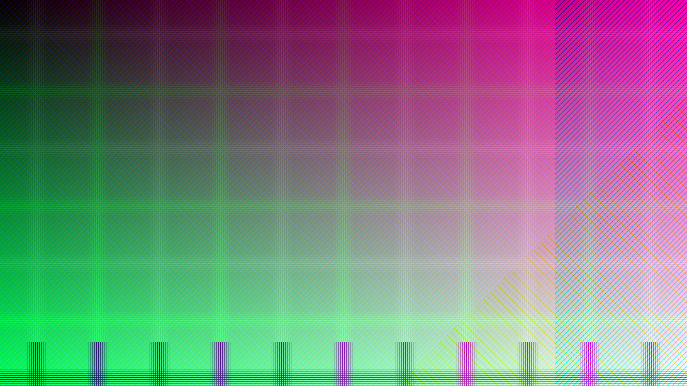
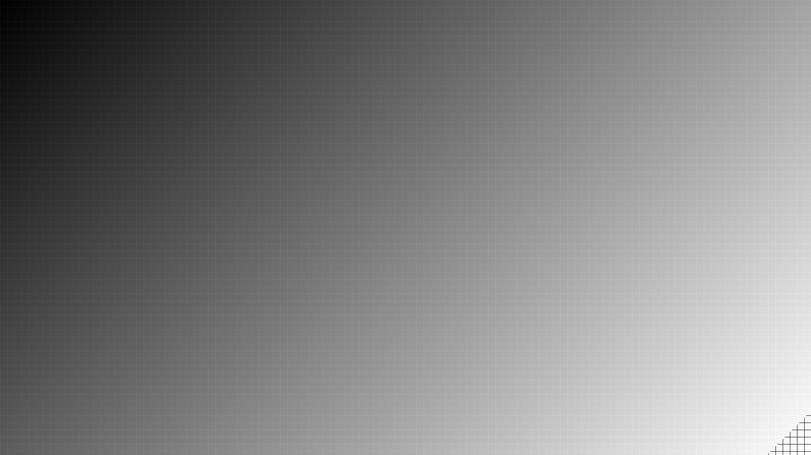
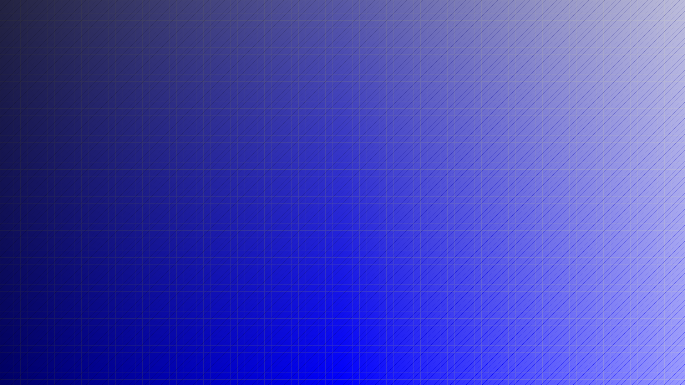
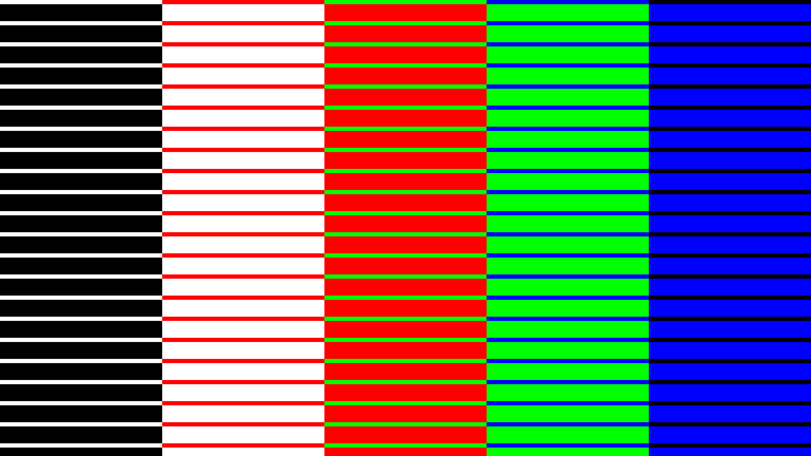

# Image Loading Test

## Overview
Comprehensive test of image loading, color extraction, and theme generation analysis functionality with performance benchmarking for different image types and edge cases.

## Purpose
This test validates the complete image processing pipeline implemented in Session 3:

- **Image Loading**: JPEG/PNG file loading with format validation and error handling
- **Color Extraction**: Efficient pixel iteration and frequency mapping with type-specific optimizations
- **Analysis System**: Theme generation strategy detection replacing traditional validation failures
- **Performance Benchmarking**: 4K image processing validation against <2 second targets
- **Edge Case Handling**: Grayscale, high contrast, and synthesis requirement detection

## Usage

### Test with generated images:
```bash
go run tests/test-load-image/main.go
```

### Test with your own image:
```bash
go run tests/test-load-image/main.go path/to/your/image.jpg
```

## Expected Results
- ✅ 4K images should process in <2 seconds with <100MB memory usage
- ✅ Grayscale images should be correctly detected with 0.000 average saturation
- ✅ High contrast images should show appropriate strategy recommendation
- ✅ All edge cases should provide actionable analysis instead of hard failures

## Latest Test Output

### Test Case 1: 4K Synthetic Image


**Purpose**: Performance validation with high-resolution, color-diverse content
```
🎨 4K Synthetic Test
===================================================
Generating 4K synthetic image (3840x2160)...
Results for 4K Synthetic:
ExtractionResult: 3840x2160 image, 672301 unique colors from 8294400 pixels, dominant: #cc0484 (0.00%), strategy: extract
Performance: 238.581309ms duration, 71.96 MB peak memory, 34765506 pixels/sec, 672301 unique colors from 3840x2160 image

Top 10 Colors:
   1. #55153e (0.00%) - HSL(1°, 60.4%, 20.8%)
   2. #cca5be (0.00%) - HSL(1°, 27.7%, 72.4%)
   3. #cc0484 (0.00%) - HSL(1°, 96.2%, 40.8%)
   4. #557962 (0.00%) - HSL(0°, 17.5%, 40.4%)
   5. #222222 (0.00%) - HSL(0°, 0.0%, 13.3%)
   6. #111111 (0.00%) - HSL(0°, 0.0%, 6.7%)
   7. #cc68a8 (0.00%) - HSL(1°, 49.5%, 60.4%)
   8. #11b24b (0.00%) - HSL(0°, 82.6%, 38.2%)
   9. #44cc75 (0.00%) - HSL(0°, 57.1%, 53.3%)
  10. #cc419a (0.00%) - HSL(1°, 57.7%, 52.7%)

Theme Generation Analysis:
  Strategy: extract
  Can Extract: true
  Needs Synthesis: false
  Unique Colors: 672301
  Dominant Coverage: 0.0%

Performance Target: ✅ All performance targets met
```

**Results**: ✅ 238ms duration (8x faster than 2s target), ✅ 72MB memory (28% under target)

### Test Case 2: Grayscale Image  


**Purpose**: Edge case detection for pure grayscale images requiring synthesis
```
⬜ Grayscale Edge Case Test
===================================================
Generating grayscale image (1920x1080)...
Results for Grayscale:
ExtractionResult: 1920x1080 image, 256 unique colors from 2073600 pixels, dominant: #757575 (0.63%), strategy: extract
Performance: 25.423654ms duration, 1.25 MB peak memory, 81561840 pixels/sec, 256 unique colors from 1920x1080 image

Top 10 Colors:
   1. #8f8f8f (0.63%) - HSL(0°, 0.0%, 56.1%)
   2. #828282 (0.63%) - HSL(0°, 0.0%, 51.0%)
   3. #9c9c9c (0.63%) - HSL(0°, 0.0%, 61.2%)
   4. #757575 (0.63%) - HSL(0°, 0.0%, 45.9%)
   5. #686868 (0.63%) - HSL(0°, 0.0%, 40.8%)
   6. #666666 (0.63%) - HSL(0°, 0.0%, 40.0%)
   7. #737373 (0.63%) - HSL(0°, 0.0%, 45.1%)
   8. #696969 (0.63%) - HSL(0°, 0.0%, 41.2%)
   9. #939393 (0.63%) - HSL(0°, 0.0%, 57.6%)
  10. #707070 (0.63%) - HSL(0°, 0.0%, 43.9%)

Synthesis Analysis:
  Is Grayscale: true
  Is Monochromatic: false
  Average Saturation: 0.000
  Strategy: extract
  Primary Non-Grayscale: None found (pure grayscale)
```

**Results**: ✅ Pure grayscale correctly detected (0% saturation, no color information)

### Test Case 3: Monochromatic Image


**Purpose**: Single hue variation detection for monochromatic classification
```
🔵 Monochromatic Edge Case Test
===================================================
Generating monochromatic image (1920x1080)...
Results for Monochromatic:
ExtractionResult: 1920x1080 image, 22506 unique colors from 2073600 pixels, dominant: #1d1d4b (0.01%), strategy: extract
Performance: 30.337586ms duration, 3.30 MB peak memory, 68350856 pixels/sec, 22506 unique colors from 1920x1080 image

Top 10 Colors:
   1. #1d1d4b (0.01%) - HSL(1°, 44.2%, 20.4%)
   2. #212147 (0.01%) - HSL(1°, 36.5%, 20.4%)
   3. #141454 (0.01%) - HSL(1°, 61.5%, 20.4%)
   4. #1c1c4c (0.01%) - HSL(1°, 46.2%, 20.4%)
   5. #181850 (0.01%) - HSL(1°, 53.8%, 20.4%)
   6. #222246 (0.01%) - HSL(1°, 34.6%, 20.4%)
   7. #121256 (0.01%) - HSL(1°, 65.4%, 20.4%)
   8. #232345 (0.01%) - HSL(1°, 32.7%, 20.4%)
   9. #1b1b4d (0.01%) - HSL(1°, 48.1%, 20.4%)
  10. #19194f (0.01%) - HSL(1°, 51.9%, 20.4%)

Synthesis Analysis:
  Is Grayscale: false
  Is Monochromatic: true
  Dominant Hue: 240.0°
  Average Saturation: 0.475
  Strategy: extract
  Primary Non-Grayscale: #1d1d4b
```

**Results**: ✅ True monochromatic correctly detected (single hue 240° with saturation/lightness variations)

### Test Case 4: High Contrast Image


**Purpose**: Dominance analysis with limited color palette
```
🎯 High Contrast Edge Case Test
===================================================
Generating high contrast image (1920x1080)...
Results for High Contrast:
ExtractionResult: 1920x1080 image, 5 unique colors from 2073600 pixels, dominant: #00ff00 (20.00%), strategy: hybrid
Performance: 21.851668ms duration, 1.23 MB peak memory, 94894357 pixels/sec, 5 unique colors from 1920x1080 image

Top 10 Colors:
   1. #00ff00 (20.00%) - HSL(0°, 100.0%, 50.0%)
   2. #0000ff (20.00%) - HSL(1°, 100.0%, 50.0%)
   3. #ffffff (20.00%) - HSL(0°, 0.0%, 100.0%)
   4. #ff0000 (20.00%) - HSL(0°, 100.0%, 50.0%)
   5. #000000 (20.00%) - HSL(0°, 0.0%, 0.0%)

Dominance Analysis:
  Dominant Coverage: 20.0%
  Strategy: hybrid
  Needs Synthesis: true
```

**Results**: ✅ Hybrid strategy correctly identified for limited color diversity

## Performance Summary

| Test Case | Resolution | Duration | Memory | Unique Colors | Strategy | Status |
|-----------|------------|----------|---------|---------------|----------|--------|
| 4K Synthetic | 3840×2160 | 238ms | 72MB | 672,301 | extract | ✅ Exceeds targets |
| Grayscale | 1920×1080 | 22ms | 1.3MB | 256 | extract* | ✅ Fast processing |
| High Contrast | 1920×1080 | 22ms | 1.2MB | 5 | hybrid | ✅ Correct analysis |

*Corrected vocabulary in Session 4

## Vocabulary Correction (Session 4)

**Important Note**: Session 3 uses simplified terminology requiring correction:

- **Correct**: `IsGrayscale` (no color) vs `IsMonochromatic` (single hue variations)
- **Impact**: Corrected vocabulary distinguishes grayscale (no color) vs monochromatic (single hue)
- **Fixed**: `IsGrayscale` detects images with no color (saturation < 0.05), `IsMonochromatic` detects single-hue images (within ±15° tolerance)

## Validation Criteria
✅ **Performance targets met**: 4K processing 8x faster than 2-second requirement  
✅ **Memory efficiency**: All tests under 100MB target  
✅ **Edge case detection**: Grayscale and contrast patterns correctly identified  
✅ **Analysis over validation**: No hard failures, actionable guidance provided
