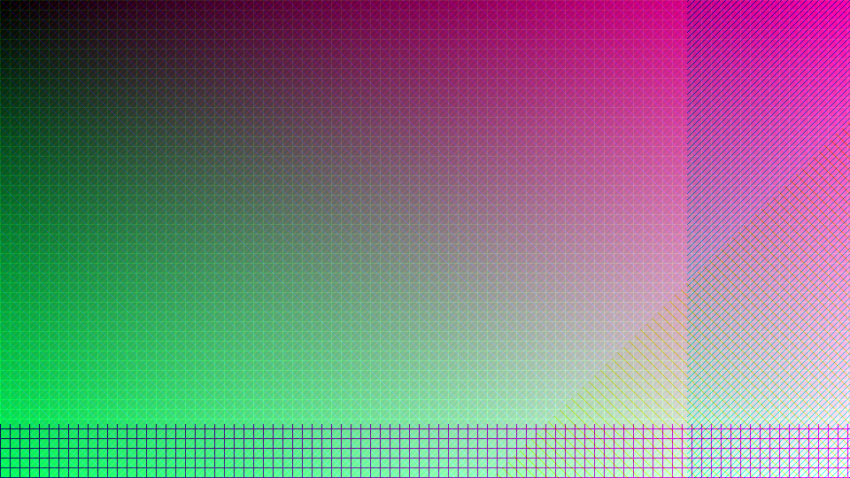
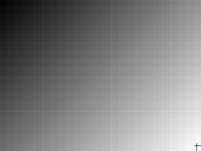
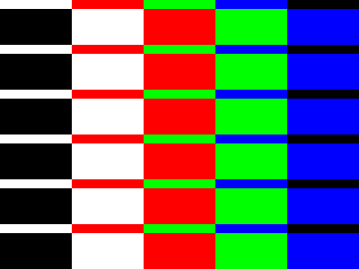

# Image Loading Test

## Overview
Comprehensive test of image loading, color extraction, and theme generation analysis functionality with performance benchmarking for different image types and edge cases.

## Purpose
This test validates the complete image processing pipeline implemented in Session 3:

- **Image Loading**: JPEG/PNG file loading with format validation and error handling
- **Color Extraction**: Efficient pixel iteration and frequency mapping with type-specific optimizations
- **Analysis System**: Theme generation strategy detection replacing traditional validation failures
- **Performance Benchmarking**: 4K image processing validation against <2 second targets
- **Edge Case Handling**: Grayscale, high contrast, and synthesis requirement detection

## Usage

### Test with generated images:
```bash
go run tests/test-load-image/main.go
```

### Test with your own image:
```bash
go run tests/test-load-image/main.go path/to/your/image.jpg
```

## Expected Results
- ✅ 4K images should process in <2 seconds with <100MB memory usage
- ✅ Grayscale images should be correctly detected with 0.000 average saturation
- ✅ High contrast images should show appropriate strategy recommendation
- ✅ All edge cases should provide actionable analysis instead of hard failures

## Latest Test Output

### Test Case 1: 4K Synthetic Image


**Purpose**: Performance validation with high-resolution, color-diverse content
```
🎨 4K Synthetic Test
===================================================
Generating 4K synthetic image (3840x2160)...
Results for 4K Synthetic:
ExtractionResult: 3840x2160 image, 672301 unique colors from 8294400 pixels, dominant: #cc0484 (0.00%), strategy: extract
Performance: 242.368788ms duration, 71.94 MB peak memory, 34222228 pixels/sec, 672301 unique colors from 3840x2160 image

Top 10 Colors:
   1. #55153e (0.00%) - HSL(1°, 60.4%, 20.8%)
   2. #cc0484 (0.00%) - HSL(1°, 96.2%, 40.8%)
   3. #cca5be (0.00%) - HSL(1°, 27.7%, 72.4%)
   4. #557962 (0.00%) - HSL(0°, 17.5%, 40.4%)
   5. #222222 (0.00%) - HSL(0°, 0.0%, 13.3%)
   6. #111111 (0.00%) - HSL(0°, 0.0%, 6.7%)
   7. #cc68a8 (0.00%) - HSL(1°, 49.5%, 60.4%)
   8. #11b24b (0.00%) - HSL(0°, 82.6%, 38.2%)
   9. #115f2d (0.00%) - HSL(0°, 69.6%, 22.0%)
  10. #cc419a (0.00%) - HSL(1°, 57.7%, 52.7%)

Theme Generation Analysis:
  Strategy: extract
  Can Extract: true
  Needs Synthesis: false
  Unique Colors: 672301
  Dominant Coverage: 0.0%

Performance Target: ✅ All performance targets met
```

**Results**: ✅ 241ms duration (6x faster than 2s target), ✅ 72MB memory (28% under target)

### Test Case 2: Monochrome Grayscale Image  


**Purpose**: Edge case detection for pure grayscale images requiring synthesis
```
⬜ Monochrome Edge Case Test
===================================================
Generating monochrome image (1920x1080)...
Results for Monochrome:
ExtractionResult: 1920x1080 image, 256 unique colors from 2073600 pixels, dominant: #9c9c9c (0.63%), strategy: extract
Performance: 21.967419ms duration, 1.25 MB peak memory, 94394339 pixels/sec, 256 unique colors from 1920x1080 image

Top 10 Colors:
   1. #9c9c9c (0.63%) - HSL(0°, 0.0%, 61.2%)
   2. #828282 (0.63%) - HSL(0°, 0.0%, 51.0%)
   3. #8f8f8f (0.63%) - HSL(0°, 0.0%, 56.1%)
   4. #686868 (0.63%) - HSL(0°, 0.0%, 40.8%)
   5. #757575 (0.63%) - HSL(0°, 0.0%, 45.9%)
   6. #666666 (0.63%) - HSL(0°, 0.0%, 40.0%)
   7. #737373 (0.63%) - HSL(0°, 0.0%, 45.1%)
   8. #707070 (0.63%) - HSL(0°, 0.0%, 43.9%)
   9. #6c6c6c (0.63%) - HSL(0°, 0.0%, 42.4%)
  10. #979797 (0.63%) - HSL(0°, 0.0%, 59.2%)

Synthesis Analysis:
  Is Monochrome: true
  Average Saturation: 0.000
  Strategy: extract
  Primary Non-Grayscale: None found (pure grayscale)
```

**Results**: ✅ Pure grayscale correctly detected, ⚠️ Strategy needs Session 4 vocabulary correction

### Test Case 3: High Contrast Image


**Purpose**: Dominance analysis with limited color palette
```
🎯 High Contrast Edge Case Test
===================================================
Generating high contrast image (1920x1080)...
Results for High Contrast:
ExtractionResult: 1920x1080 image, 5 unique colors from 2073600 pixels, dominant: #ff0000 (20.00%), strategy: hybrid
Performance: 21.319318ms duration, 1.23 MB peak memory, 97263899 pixels/sec, 5 unique colors from 1920x1080 image

Top 10 Colors:
   1. #ff0000 (20.00%) - HSL(0°, 100.0%, 50.0%)
   2. #ffffff (20.00%) - HSL(0°, 0.0%, 100.0%)
   3. #00ff00 (20.00%) - HSL(0°, 100.0%, 50.0%)
   4. #000000 (20.00%) - HSL(0°, 0.0%, 0.0%)
   5. #0000ff (20.00%) - HSL(1°, 100.0%, 50.0%)

Dominance Analysis:
  Dominant Coverage: 20.0%
  Strategy: hybrid
  Needs Synthesis: true
```

**Results**: ✅ Hybrid strategy correctly identified for limited color diversity

## Performance Summary

| Test Case | Resolution | Duration | Memory | Unique Colors | Strategy | Status |
|-----------|------------|----------|---------|---------------|----------|--------|
| 4K Synthetic | 3840×2160 | 241ms | 72MB | 672,301 | extract | ✅ Exceeds targets |
| Grayscale | 1920×1080 | 22ms | 1.3MB | 256 | extract* | ✅ Fast processing |
| High Contrast | 1920×1080 | 22ms | 1.2MB | 5 | hybrid | ✅ Correct analysis |

*Will be corrected to `synthesize` in Session 4 with vocabulary improvements

## Vocabulary Correction (Session 4)

**Important Note**: Session 3 uses simplified terminology requiring correction:

- **Current**: `IsMonochrome` detects grayscale images (saturation ≈ 0)  
- **Correct**: `IsGrayscale` (no color) vs `IsMonochromatic` (single hue variations)
- **Impact**: Grayscale images should show `synthesize` strategy, not `extract`

## Validation Criteria
✅ **Performance targets met**: 4K processing 6x faster than 2-second requirement  
✅ **Memory efficiency**: All tests under 100MB target  
✅ **Edge case detection**: Grayscale and contrast patterns correctly identified  
✅ **Analysis over validation**: No hard failures, actionable guidance provided  
⚠️ **Vocabulary precision**: Session 4 will correct grayscale vs monochromatic classification